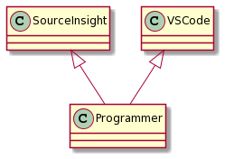

# [面对对象简介与 C++ 类的基本介绍](/resource/C++面对对象简介/2021-11-25-C++面对对象简介-产品四部-李建聪.pdf)([PPT](/resource/C++面对对象简介/2021-11-25-C++面对对象简介-产品四部-李建聪.pptx))

[[_TOC_]]

## C++ 构造函数与析构函数

类的基本组合元素。
构造函数、析构函数、拷贝构造函数和拷贝复制符

构造函数在对象被创建的时候调用，如:

```c++
class A
{
};

int main()
{
    A obj;          ///< 调用构造函数
    A* p = new A;   ///< 调用构造函数
}
```

析构函数在对象被销毁时刻调用，如：

```c++
int main()
{
    {
        A obj;
    }   ///< 临时变量超出作用域，调用析构函数

    A* p = new A;
    delete p;   ///< 调用析构函数
}
```

构造与析构函数的具体讲解可见 [类内默认成员函数](https://mercy1101.github.io/c++/2020/12/11/C++-%E7%B1%BB%E5%86%85%E9%BB%98%E8%AE%A4%E6%88%90%E5%91%98%E5%87%BD%E6%95%B0.html)

## 面对对象的简介

对象有三个特点: 封装、继承和多态。

### 封装

* 封装方法
* 聚合数据
* 隐藏细节

#### 封装方法

当我们在使用对象时，自然而然可以把一系列方法放在一个类内，就比如我们想要定义一系列读取 `Json` 字符串的方法。

下面是 `C 语言`的封装方法:

```c++
GJSON*  gos_json_init(void);
void    gos_json_free(GJSON* Json);
bool    gos_json_parse(GJSON* Json, char *szJson);
char*   gos_json_get_string (GJSON* Json, char *szKey);
```

我们推断使用顺序是:

1. 使用 `gos_json_init` 来获取一个可用的 `Json` 解析用的结构体, 其中存储了一些信息。
2. 使用 `gos_json_parse` 来读取一系列 `Json` 字符串中的键值。
3. 使用 `gos_json_get_string` 来通过键来获取值。
4. 最后使用 `gos_json_free` 来释放资源。

那么调用过程如以下代码:

```c++
int main()
{
    GJSON* pJson = gos_json_init();
    gos_json_parse(pJson, "Json string");
    char* szValue = gos_json_get_string(pJson, "Key");
    ...
    gos_json_free(pJson);
}
```

对比面对对象接口:

```c++
class Json
{
public:
    bool    parse(char *szJson);
    char*   get_string (char *szKey);

private:
    GJSON* m_Json;
};
```

如上面所示: `C++`的接口

由于类内保存了一个 `GJSON` 的指针 `m_Json`, 所以接口函数不需要 `GJSON*` 的入参.
由于可以被调用的函数只有两个，那我们可以推测调用方法:

1. 使用 `parser` 接口函数解析 `json` 字符串
2. 使用 `get_string` 接口函数来获取对应键的值

调用如下:

```c++
int main()
{
    Json obj;
    obj.parser("Json string");
    char* szValue = obj.get_string("Key");
}
```

由上面的调用可以看到少了调用 `init` 和 `free` 两个函数的过程，因为 `class` 可以使用构造函数中初始化自己，在析构函数中做相反动作，我们下面补充构造函数和析构函数的定义。

```c++
class Json
{
public:
    /// 构造函数
    Json()
    {
        m_Json = init();
    }

    /// 析构函数
    ~Json()
    {
        free(m_Json);
    }

    bool    parse(char *szJson);
    char*   get_string (char*szKey);

private:
    GJSON* m_Json;
    GJSON* init();
    void free(GJSON* Json);
};
```

#### 聚合数据

`class` 带来的好处是，类内不仅可以定义函数，也可以聚合成员，定义在一起方便查看与传递。

例如我们有一堆配置项数据需要保存。

C 语言可以这样写

```c++
unsigned g_ulLogLevel;
bool     g_bLogToStdout;
bool     g_bLogToFile;

void GetLogCfg()
{
    /// 给变量赋值
    g_ulLogLevel = 1;
    g_bLogToStdout = TRUE;
    g_bLogToFile = TRUE;
}

/// 在其他 cpp 文件中访问这些配置项
extern unsigned g_ulLogLevel;
extern bool     g_bLogToStdout;
extern bool     g_bLogToFile;
```

C++ 可以这样写

```c++
class LocalCfg
{
public:
    LocalCfg() { GetLogCfg(); }

    unsigned m_ulLogLevel;
    bool     m_bLogToStdout;
    bool     m_bLogToFile;

private:
    void GetLogCfg();
};

/// 在其他地方访问这些配置项
int main()
{
    LogCfg obj;

    obj.m_ulLogLevel;
    obj.m_bLogToStdout;
    obj.m_bLogToFile;
}
```

另外我们经常在类中见到函数 `Get` 和 `Set`

```c++
class LocalCfg
{
public:
    void Set(int i) { value = i; }
    int Get() { return value; }
private:
    int value;
};
```

我们为什么要把一个简单的赋值操作封装成函数呢？

如果我们想要把变量的赋值与其他业务联动，见下面的例子:

1. 追踪赋值，添加打印

```c++
class LocalCfg
{
public:
    void Set(int i)
    {
        GosLog(LOG_DETAIL, "value: %d -> %d", value, i);
        value = i;
    }
    int Get() { return value; }
private:
    int value;
};
```

2. 添加锁来支持多线程

```c++
class LocalCfg
{
public:
    void Set(int i)
    {
        mutex.lock();
        value = i;
        mutex.unlock();
    }

    int Get()
    {
        mutex.lock();
        int value_temp = value;
        mutex.unlock();
        return value_temp;
    }

private:
    int value;
    GMutex mutex;
};
```

3. 业务联动绑定

```c++
class LocalCfg
{
public:
    void Set(int i)
    {
        value = i;
        IsSet = true;
    }

    int Get()
    {
        if (IsSet)
        {
            return value;
        }
        else
        {
            /// 返回无效值
            return -1;
        }
    }

private:
    int value;
    // 用于记录 value 是否有效
    bool IsSet = false;
};
```

#### 隐藏细节

见下面代码:

```c++
class A
{
public:
    /// 把大象放进冰箱里
    bool PutElephantInFreezer()
    {
        /// 打开冰箱门
        OpenFreezerDoor();
        /// 把大象放进去
        LetElephantIn();
        /// 关上冰箱门
        CloseFreezerDoor();
    }

private:
    void OpenFreezerDoor();
    void LetElephantIn();
    void CloseFreezerDoor();
};

int main()
{
    A obj;
    // 调用 public 函数来把大象放进冰箱里
    obj.PutElephantInFreezer();
}
```

#### 相关语法介绍

##### 关于 `public` 与 `private`

关于关键字 `public` 和 `private`, `public` 类型的类内成员变量和函数，可以被类的实例调用而 `private` 不能。

实例化简单来说就是，把一个就是在代码中定义该对象。(如果把类的定义比作蛋糕模子，那么类的实例就是蛋糕)

```c++
class OBJECT
{
public:
    int i_public;
private:
    int i_private;
};

int main()
{
    // 对象实例化
    OBJECT obj;

    // 对象实例访问 public 类成员
    obj.i_public = 1;

    // 对象实例无法访问 private 成员
    // obj.i_private = 1;
}
```

##### 友元函数介绍 (`friend function`)

对于私有变量和私有成员函数, 友元函数可以打破访问权限限制。

```c++
class A
{
    friend void Set(A& obj, int num);
private:
    int i_private;
};

/// 友元函数不属于某个类，所以定义时
/// 不需要这样写:
/// void count::Set(counter& obj, int num)
void Set(A& obj, int num)
{
    /// 友元函数内，对象实例访问对象私有成员
    obj.i_private = num;
}
```

1. 友元函数本质是普通函数，友元只是描述的是对类的友元。

2. 友元函数不属于类，是独立的函数，所以不受作用域描述符的限制。

3. 友元函数本身可以同时成为多个类的友元函数。

```c++
class B;

class A
{
    friend void Set(A& obja, B& objb, int num);
private:
    int i_private;
};

class B
{
    friend void Set(A& obja, B& objb, int num);
private:
    int i_private;
};

void Set(A& obja, B& objb, int num)
{
    obja.i_private = num;
    objb.i_private = num;
}

int main()
{
    A obj_a;
    B obj_b;
    Set(obj_a, obj_b, 1);
    return 0;
}
```

##### 类内 `static` 与对象之间的关系

在对象内的 `static` 变量和函数，与对象的生命周期无关，每一个对象的所有实例都共享同一个 `static` 变量和函数。

类内 `static` 函数对类内的静态成员函数、构造函数、析构函数和静态成员变量享有访问权限。

###### 类内静态变量

```c++
class A
{
public:
    static int counter = 0; ///< 记录对象被实例化了多少次
    A(){count++;}
};

int main()
{
    A obj;
    std::cout << A::counter << std::endl;
}
```

###### 类内静态成员函数

```c++
class A
{
public:
    static int counter;
    static int GetCounter()
    {
        return counter;
    }

public:
    int i_non_static = 0;
    int fun_non_static()
    {
        printf("Hello World!");
    }
};

int A::counter = 0;

int main()
{
    A obj0;
    A obj1;
    printf("%d", A::GetCounter());
    printf("%d", obj0.GetCounter());
    printf("%d", obj1.GetCounter());
    return 0;
}
```

如上面所示 类内静态成员函数是可以直接访问类内静态成员变量也可以调用类内静态成员函数
但不能调用类内非静态成员变量和函数, 如 `i_non_static`、 `fun_non_static`

静态成员函数的使用限制，不能调用非 `static` 的类内成员函数和成员变量。

类内静态函数在单例模式中的应用

```c++
class Singleton
{
public:
    static Singleton& GetInstance()
    {
        static Singleon* pInstance = NULL;
        if(pInstance == NULL)
        {
            pInstance = new Singleon;
        }
        return *pInstance;
    }

private:
    Singleon() {}
};
```

### 继承

继承用来从基类中继承来函数或成员变量, 省却重复定义。

假如我们有很多呼叫相关的业务，都需要一个唯一的业务标识号。

```c++
class base
{
public:
    base() : strBusinessID(gos::GetUUID()) {}
public:
    std::string strBusinessID;
};

/// 点呼从基类中继承出来了一个业务 ID
class P2PCall : public base
{};

int main()
{
    P2PCall p2p_call;   ///< 自动生成了一个唯一的业务号

    std::cout << p2p_call.strBusinessID << std::endl;
}
```

#### 相关语法介绍

##### 虚析构函数

```c++
class base
{
    virtual ~base(){ std::cout << "~base" << std::endl; }
};

class derive: public base
{
    virtual ~derive() { std::cout << "~derive" << std::endl; } ///< 不定义虚析构函数会导致内存泄漏
};

int main()
{
    base* p = new derive;
    delete p;
}
```

##### `protected` 关键字

```c++
class base
{
private:
  int i_private;
protected:
  int i_protected;
};

class derive : public base
{
public:
  int get_protected()
  {
    // 可访问基类中的 protected 成员
    return i_protected;
  }

  // int get_private()
  // {
  //   基类中的 private 成员不能被派生类访问
  //   return i_private;
  // }
};

int main()
{
  base obj0;
  // 在基类实例中表现为私有成员, 不可访问
  // obj0.i_protected = 0;
  derive obj;
  // 在派生类实例中表现为私有成员, 不可访问
  // obj.i_protected = 0;
  return 0;
}
```

##### 多重继承

假设一个程序员又想拥有使用 `VSCode` 的能力 又想拥有使用 `source insight` 能力，`UML` 图如下



写成代码为:

```c++
class VSCode
{
public:
    void UseVSCode();
};

class SourceInsight
{
public:
    void UseSourceInsight();
};

// class Programmer 拥有了 class VSCode 和
// class SourceInsight 中的方法函数
class Programmer : public VSCode, public SourceInsight
{
};

int main()
{
    Programmer lijiancong;
    lijiancong.UseVSCode();
    lijiancong.UserSourceInsight();
}
```

如果两个基类中拥有同名成员变量或函数，则派生类使用时应标注该成员变量或函数的作用域，避免产生编译错误。

```c++
class A
{
protected:
  int i_protected;
};

class B
{
protected:
  int i_protected;
};

class Derive : public A, public B
{
public:
  int get()
  {
    /// 如果两个基类中拥有同名成员变量或函数，
    /// 派生类使用时应该标注哪个类的成员变量或函数， 否则编译错误
    return A::i_protected;
  }
};
```

##### 使用 `virtual` 阻隔菱形继承

我们在使用多重继承时，可能会出现如下的情况。

可能出现如下情况:


菱形继承不仅会出现二义性成员变量名或函数名，而且在虚函数的继承中，中间类每一个类都会保存一个继承的副本，导致未知问题。使用 `virtual` 关键字避免菱形继承导致的问题。

```c++
class Tool
{
public:
  Tool()
  {
    std::cout << "Tool::i: " << &i
              << std::endl;
  }
protected:
  int i = 1;
};

class VSCode : public Tool
{
public:
  VSCode()
  {
    std::cout << "VSCode::i: " << &(VSCode::i)
              << std::endl;
  }
};

class SourceInsight : public Tool
{
public:
  SourceInsight()
  {
    std::cout << "SourceInsight::i: "
              << &(SourceInsight::i)
              << std::endl;
  }
};

class Programmer : public VSCode, public SourceInsight
{
};

int main()
{
    Programmer lijiancong;
    return 0;
}
```


如上图， `VSCode` 和 `SourceInsight` 两个类都保存了一份基类 `Tool::i` 的副本, 造成了二义性。使用 `virtual` 来避免菱形继承带来的问题

```c++
class Tool
{
protected:
  int i;
};

///  使用 `virtual` 关键字来避免菱形继承
class VSCode : virtual public Tool
{
};

///  使用 `virtual` 关键字来避免菱形继承
class SourceInsight : virtual public Tool
{
};

class Programmer : public VSCode, public SourceInsight
{
public:
  int get()
  {
    return i; ///< 正常使用 Tool 类中的函数
  }
};

int main()
{
    Programmer lijiancong;
    lijiancong.get();
}
```

如果上述对象 `VSCode` 和 `SourceInsight` 没有使用关键字 `virtual` 来标注继承方式，那么 `Programmer` 类中正常使用 `Tool::i`。

##### 继承的方式与访问权限

`public`、`private`、`protected` 三种继承方式

见基类定义:

```c++
class base
{
public:
  int i_public;
protected:
  int i_protected;
private:
  int i_private;
};
```

`public` 继承：

* 基类中 `public` 成员， 在派生类中表现为 `public`
* 基类中 `protected` 成员，在派生类中表现为 `protected`
* 基类中 `private` 成员，在派生类中不可访问

```c++
/// public 继承
class derive : public base
{
public:
  void get()
  {
    i_public = 0;       ///< 基类中 `public` 成员， 在派生类中表现为 `public`
    i_protected = 0;    ///< 基类中 `protected` 成员，在派生类中表现为 `protected`
    /// i_private = 0;  ///< 基类中 `private` 成员，在派生类中不可访问
  }
};

int main()
{
    derive obj;
    obj.i_public = 0;
    /// obj.i_protected = 0;  不可访问
    /// obj.i_private = 0;  不可访问
    return 0;
}

```

`protected` 继承：

* 基类中 `public` 成员， 在派生类中表现为 `protected`
* 基类中 `protected` 成员，在派生类中表现为 `protected`
* 基类中 `private` 成员，在派生类中不可访问

`protected` 继承与 `public` 继承相比， 区别在于 基类中 `public` 成员在 `protected` 继承后的派生类中降级为 `protected`。

```c++
class derive : protected base
{
public:
  void get()
  {
    i_public = 0;       ///< 基类中 `public` 成员， 在派生类中表现为 `protected`
    i_protected = 0;    ///< 基类中 `protected` 成员，在派生类中表现为 `protected`
    /// i_private = 0;  ///< 基类中 `private` 成员，在派生类中不可访问
  }
};

class derive0 : public derive
{
  void get0()
  {
    i_public = 0;
    i_protected = 0;
    /// i_private = 0;
  }
};

int main()
{
    derive0 obj;
    obj.get();
    /// obj.i_public = 0;     不可访问
    /// obj.i_protected = 0;  不可访问
    /// obj.i_private = 0;    不可访问
    return 0;
}
```

`private` 继承：

* 基类中 `public` 成员，在派生类中表现为 `protected`
* 基类中 `protected` 成员，在派生类中表现为 `protected`
* 基类中 `private` 成员，在派生类中不可访问

`private` 继承与 `public` 继承相比，区别在于基类中 `public` 成员和 `protected` 成员在 `private` 继承后的派生类中都降级为 `private`。

```c++
class derive : private base
{
public:
  void get()
  {
    i_public = 0;       ///< 基类中 `public` 成员， 在派生类中表现为 `private`
    i_protected = 0;    ///< 基类中 `protected` 成员，在派生类中表现为 `private`
    /// i_private = 0;  ///< 基类中 `private` 成员，在派生类中不可访问
  }
};

class derive0 : public derive
{
  void get0()
  {
    /// i_public = 0;
    /// i_protected = 0;
    /// i_private = 0;
  }
};

int main()
{
    derive0 obj;
    obj.get();
    /// obj.i_public = 0;     不可访问
    /// obj.i_protected = 0;  不可访问
    /// obj.i_private = 0;    不可访问
    return 0;
}
```

总而言之，什么类型的继承，在派生类中最高的类成员访问权限就降级为什么类型。

### 多态

多态用于接口与多态实现的分离

下面代码示例为多态在工厂模式中的应用。

```c++
class Interface
{
public:
    virtual void Insert() = 0;
    virtual void Query() = 0;
};

class MySqlImpl : public Interface
{
public:
    virtual void Insert()
    {
        MySql_Insert();
    }

    virtual void Query()
    {
        MySql_Query();
    }
};

class RedisImpl : public Interface
{
public:
    virtual void Insert()
    {
        Redis_Insert();
    }

    virtual void Query()
    {
        Redis_Query();
    }
};

class Factory
{
public:
    static Interface* getInterface(bool bIsUseMySQL)
    {
        if(bIsUseMySQL)
        {
            p = new MySqlImpl();
        }
        else
        {
            p = new RedisImpl();
        }
    }
};

int main()
{
    Factory factory;
    Interface* p = factory.GetInterface(true);
    // 通过基类指针指向派生类
    // 调用基类中的虚函数，会通过编译器自动识别
    // 是使用 MySQL 的实现还是 Redis 的实现
    p->Insert();
    p->Query();
}
```

上面代码使用多态进行了函数覆盖(`override`), 但是在基类和派生类中出现了同名但不同入参的函数名，则会发生函数隐藏(`hide`)。

```c++
class Interface
{
public:
      virtual void Insert(int i) { std::cout << "Interface::Insert" << std::endl; }
};

class MySqlImpl : public Interface
{
public:
    ///  这里没有使用多态对基类中的 `Insert` 函数进行覆盖(override), 而是单独创建了一个新的虚函数
    virtual void Insert(std::string s) { std::cout << "MySQL::Insert" << std::endl; }
};

class RedisImpl : public Interface
{
public:
    virtual void Insert(int d) { std::cout << "RedisImpl::Insert" << std::endl; }
};

int main()
{
  Interface* pRedis = new RedisImpl;
  pRedis->Insert(1);  ///< 正常使用多态，访问派生类的 `Insert` 函数的实现

  Interface* pMySQL = new MySqlImpl;
  /// pMySQL->Insert("Hello World!"); 无法使用基类指针访问多态函数 `Insert`
  pMySQL->Insert(1);  ///< 只能访问基类 `Insert` 函数的实现
  return 0;
}
```

使用关键字 `override` 关键字避免因输入错误而导致函数覆盖不正确的现象。

```c++
class Interface
{
    public:
      virtual void Insert(int i) { std::cout << "Interface::Insert" << std::endl; }
};

class MySqlImpl : public Interface
{
public:
    /// 由于 `override` 要求必须该函数对基类函数进行覆盖，这里由于入参不一致, 会出现编译错误
    virtual void Insert(std::string s) override { std::cout << "MySQL::Insert" << std::endl; }
};
```

#### 虚函数表

一个基类的虚函数，在不同派生类中实现，会产生多个虚函数表。

派生类的多个实例都会保存一个指针，该指针指向对应虚函数的实现（即对应的虚函数表）。

虚函数表中放入特定实现的函数指针，被调用时，通过函数指针来调用对应的汇编。

#### 类成员变量初始化顺序

成员变量在使用初始化列表初始化时，与构造函数中初始化成员列表的顺序无关，只与定义成员变量的顺序有关。因为成员变量的初始化次序是根据变量在内存中次序有关，而内存中的排列顺序早在编译期就根据变量的定义次序决定了.

```c++
class a
{
public:
    a(): y(0), x(y+1) {}
    int x;
    int y;
};

int main()
{
    a obj;
    std::cout << "x: " << obj.x << ", y: " << obj.y;
    return 0;
}
```

> 输出:
> x: -858993459, y: 0