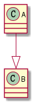
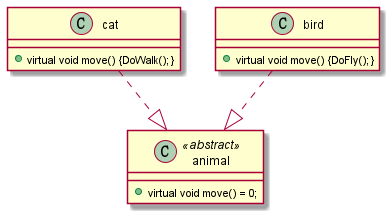
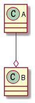
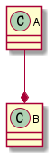
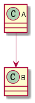
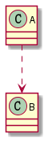

---

title:  "UML语法简介"
date:   2021-04-26 15:15:55 +0800
categories: uml
published:  true
tag: uml
typora-root-url: ..
---

# UML语法介绍

## 泛化关系(generalization)

类的继承结构表现在UML中为：泛化(generalize)与实现(realize)：

继承关系为 is-a的关系；两个对象之间如果可以用 is-a 来表示，就是继承关系：（..是..)

eg：自行车是车、猫是动物

泛化关系用一条带空心箭头的直接表示；如下图表示（A继承自B）；

eg：猫是一种动物；猫与动物之间为泛化关系。

.png)

## 实现关系(realize)

实现关系用一条带空心箭头的虚线表示；

eg："猫"和"鸟"运动方式不同，它们的运动方式一个为走一个为飞，必须要在派生类"动物"中提供具体实现，那么"猫"和"鸟"对于基类动物来说为实现关系。

## 聚合关系(aggregation)

聚合关系用一条带空心菱形箭头的直线表示，如下图表示A聚合到B上，或者说B由A组成；

聚合关系用于表示实体对象之间的关系，表示整体由部分构成的语义；例如一个部门由多个员工组成；

与组合关系不同的是，**整体和部分不是强依赖的**，即使整体不存在了，部分仍然存在；例如， 部门撤销了，人员不会消失，他们依然存在；

## 组合关系(composition)

组合关系用一条带实心菱形箭头直线表示，如下图表示A组成B，或者B由A组成；

与聚合关系一样，组合关系同样表示整体由部分构成的语义；比如公司由多个部门组成；

但组合关系是一种**强依赖的特殊聚合关系**，如果整体不存在了，则部分也不存在了；例如， 公司不存在了，部门也将不存在了；

## 关联关系(association)

关联关系是用一条直线表示的；它描述不同类的对象之间的结构关系；它是一种静态关系， 通常与运行状态无关，一般由常识等因素决定的；它一般用来定义对象之间静态的、天然的结构； 所以，关联关系是一种“强关联”的关系；

比如，乘车人和车票之间就是一种关联关系；学生和学校就是一种关联关系；

关联关系默认不强调方向，表示对象间相互知道；如果特别强调方向，如下图，表示A知道B，但 B不知道A；

注：在最终代码中，关联对象通常是以成员变量的形式实现的；

## 依赖关系(dependency)

依赖关系是用一套带箭头的虚线表示的；如下图表示A依赖于B；他描述一个对象在运行期间会用到另一个对象的关系；

与关联关系不同的是，它是一种临时性的关系，通常在运行期间产生，并且随着运行时的变化； 依赖关系也可能发生变化；

显然，依赖也有方向，双向依赖是一种非常糟糕的结构，我们总是应该保持单向依赖，杜绝双向依赖的产生；

注：在最终代码中，依赖关系体现为类构造方法及类方法的传入参数，箭头的指向为调用关系；依赖关系除了临时知道对方外，还是“使用”对方的方法和属性；