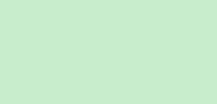
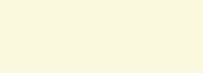
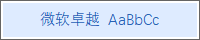
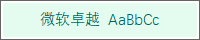
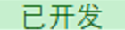
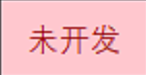

常见颜色与RGB值

## 豆沙绿

豆沙绿: 199 237 204 (#C7EDCC)

## 护眼黄

护眼黄: 250 249 222 (#FAF9DE)

## 灰色

字灰色: 155 163 178(#9BA3B2)
背景灰色: 223 225 230(#DFE1E6)

## 蓝色

字蓝色: 41 97 180(#2961B4)
背景蓝色: 222 235 255(#DEEBFF)

## 绿色

字绿色: 0 102 100(#006664)
背景绿色: 227 252 239(#E3FCEF)

字绿色: 19 99 53(#136335)
背景绿色: 198 239 206(#C6EFCE)

## 红色

字红色: 255 0 0(#FF0000)
背景橙色: 253 233 217(#FDE9D9)

字红色: 128 0 0(#800000)
背景橙红色: 255 80 80(#FF5050)

字红色: 157 38 66(#9D2642)
背景红色: 255 199 206(#FFC7CE)

## 橙色

RGB: 255 214 88(#FFD658)

RGB: 248 178 32(#F8B220)

RGB: 255 153 0(#FF9900)

RGB: 245 105 82(#F56952)

## 绿色

RGB: 176 234 101(#B0EA65)

## 蓝色

RGB: 93 209 247(#5DD1F7)

## 紫色

RGB: 112 102 243(#7066F3)
