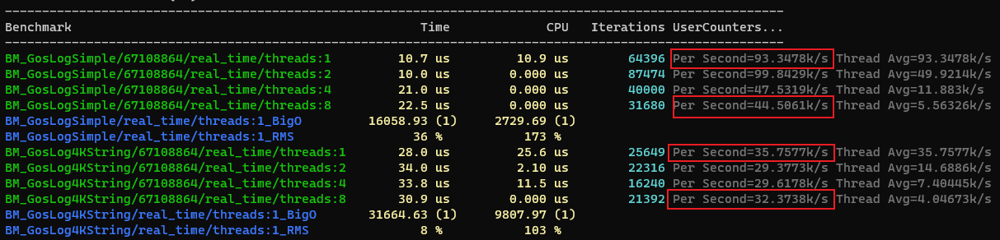
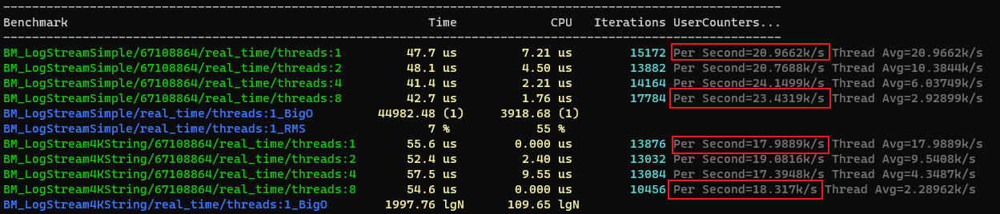
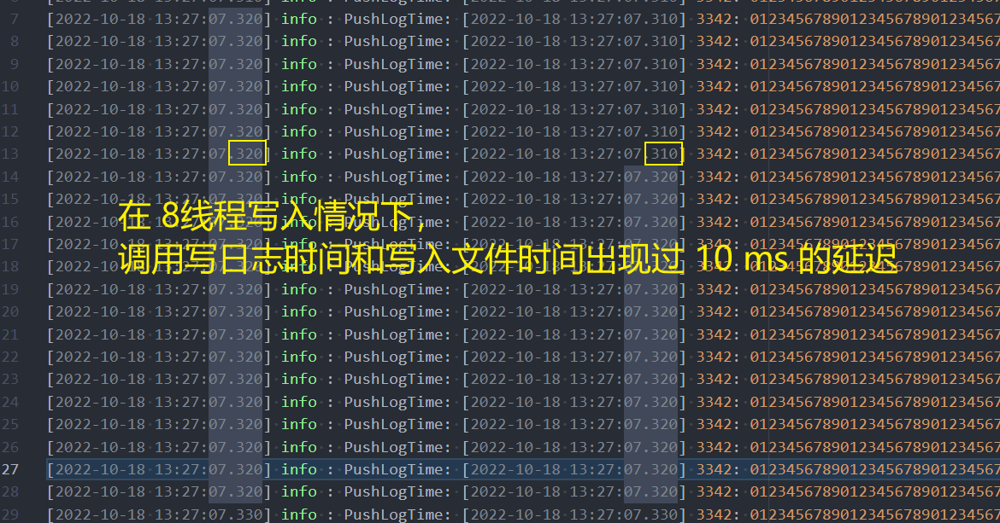
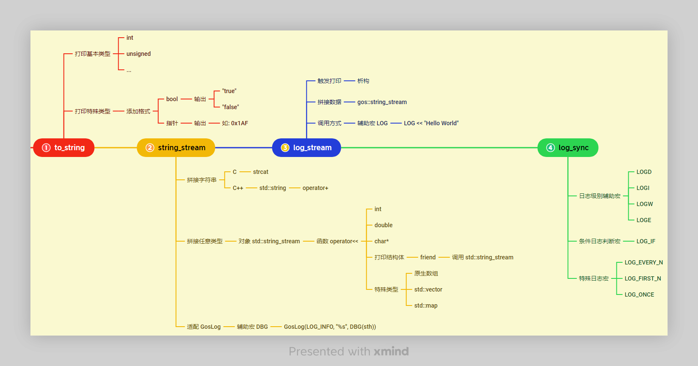

* 我们假设人是会出错的，所以我们需要调试找寻 BUG
* 我们假设框架和流程设计基本正确，所以**找寻问题的时间**远大于**改正问题的时间**
* 我们假设人是懒惰的，所以总是倾向于写更少的代码

[PPT](../resource/2021_09_13_C%2B%2B%E8%B0%83%E8%AF%95%E5%B7%A5%E5%85%B7%E5%87%BD%E6%95%B0%E4%BB%8B%E7%BB%8D_%E6%9D%8E%E5%BB%BA%E8%81%AA/2022_09_13_C%2B%2B%E8%B0%83%E8%AF%95%E5%B7%A5%E5%85%B7%E5%87%BD%E6%95%B0%E4%BB%8B%E7%BB%8D_%E6%9D%8E%E5%BB%BA%E8%81%AA.pptx)


## 调试日志打印类

### 转换字符串 to_string

应用场景: 想要把某种类型转换为字符串

简单的转换:

```c++
printf("%d", i);
```

实际中可能用到的转换:

```c++
printf("Integers\n");
printf("Decimal:\t%i %d %.6i %i %.0i %+i %i\n", 1, 2, 3, 0, 0, 4, -4);
printf("Hexadecimal:\t%x %x %X %#x\n", 5, 10, 10, 6);
printf("Octal:\t%o %#o %#o\n", 10, 10, 4);

printf("Floating point\n");
printf("Rounding:\t%f %.0f %.32f\n", 1.5, 1.5, 1.3);
printf("Padding:\t%05.2f %.2f %5.2f\n", 1.5, 1.5, 1.5);
printf("Scientific:\t%E %e\n", 1.5, 1.5);
printf("Hexadecimal:\t%a %A\n", 1.5, 1.5);
```

因为自己使用占用符可能会出现使用错误(VS 编译检测不出来, g++ 有部分警告), 为了正确和格式的统一现使用统一函数封装


基本类型的重载:

```c++
std::string to_string(int i);
std::string to_string(unsigned i);
std::string to_string(unsigned long i);
std::string to_string(unsigned long long x);
std::string to_string(long i);
std::string to_string(long long x);
std::string to_string(short x);
std::string to_string(unsigned short x);
```

特殊类型的重载:
```c++
/// 保留两位小数: 输出类似 1.12
std::string to_string(double d);
/// 返回字符串: "true" 或 "false"
std::string to_string(bool x);
/// 重载指针, 输出类似 0x123
template <typename T>
inline std::string to_string(T* const x);
```

### 使用 `string_stream` 拼接字符串

场景: 拼接字符串

#### C 是如何拼接字符串的?

```c++
char ac[1024] = {0};
strcat(ac, "Hello");
strcat(ac, "World");
strcat(ac, gos::to_string(123).c_str());
```

#### C++ 是如何拼接字符串的?

std::string 怎么实现拼接函数的

/// 编译错误

```c++
std::string str;
str = "123" + "456";
```

/// 编译成功
```c++
std::string str;
std::string strTemp("456");
str = "123" + strTemp;
```

重载 "+" 操作符，实现字符串拼接

```c++
std::string operator+(const std::string& strLeft, const std::string& strRight);
```

调用过程解析
```c++
str = "123" + strTemp;
<=>
str = operator+("123", strTemp);
<=>
str = operator+(std::string("123"), strTemp);
```

最后的拼接方式为:

```c++
std::string str;
std::string strTemp("World");
str = "Hello" + strTemp + gos::to_string(i);
<=>
str = ("Hello" + strTemp) + gos::to_string(123);
```

#### `string_stream` 是如何拼接字符串的?

```c++
gos::string_stream stream;
stream << "Hello" << "World" << 123;
```

那么 gos::string_stream 是如何实现的?

查看对象原型:

```c++
class string_stream
{
public:
    string_stream& operator<<(int i)
    {
        m_str += i;
        return *this;
    }

    ...
private:
    std::string m_str;
};
```

解析调用过程:

```c++
gos::string_stream stream;
stream << "Hello";
<=>
stream.operator<<("Hello");
```

#### `string_stream` 对其他复杂类型的处理

```c++
/// 打印 socket 地址
string_stream& operator<<(const SOCKADDR_IN& addr_in);
/// 打印 PID_T
string_stream& operator<<(const PID_T& stPID);
/// 打印 vector
template <typename T>
string_stream& operator<<(const std::vector<T>& vec);
/// 打印 二进制数据
string_stream& operator<<(const std::vector<unsigned char>& vec);
/// 打印 map
template <typename Key, typename Value>
string_stream& operator<<(const std::map<Key, Value>& map);
```

#### `string_stream` 如何转换为 std::string

```c++
class string_stream
{
public:
    std::string str()
    {
        return m_str;
    }
};
```

#### 使用 `string_stream` 打印结构体

```c++
struct STRUCT_T
{
public:
    int i;
    double d;
};
```

可以这样打印:

```c++
STRUCT_T st;
printf("%d, %f", st.i, st.d);
```

`gos::string_stream` 如何打印:

```c++
gos::string_stream& operator<<(gos::string_stream& out, const STRUCT_T& st)
{
    out << st.i << st.d;
    return out;
}

gos::string_stream stream;
stream << st;
```

考虑如下情况:

```c++
struct STRUCT_T
{
private:
    int i;
    double d;
};

/// 该函数是否可行?
gos::string_stream& operator<<(gos::string_stream& out, const STRUCT_T& st)
{
    out << st.i << st.d;
    return out;
}
```

解决方案:

```c++
struct STRUCT_T
{
private:
    int i;
    double d;

    friend gos::string_stream& operator<<(gos::string_stream& out, const STRUCT_T& st)
    {
        out << st.i << st.d;
        return out;
    }
};
```

#### string_stream 与 GosLog 的适配

##### `DBG`

查看函数定义:

```c++
template <typename T>
std::string format_dbg_string(const T& x, const std::string& strName)
{
    gos::string_stream stream;
    stream << strName << "(" << x << ")";
    return stream.str();
}
```

```c++
const char* szMsgName = "MsgName";
GosLog(LOG_INFO, "szMsgName: %s", gos::format_dbg_string(szMsgName, "szMsgName").c_str());
```

使用辅助宏定义:

```c++
#define DBG(x) gos::format_dbg_string(x, std::string(#x)).c_str()

GosLog(LOG_INFO, "szMsgName: %s", gos::format_dbg_string(szMsgName, "szMsgName").c_str());
<=>
GosLog(LOG_INFO, "%s", DBG(szMsgName));
```

##### `DBG` 给日志带来的改变

1. 省去了输入变量名称的过程, 见下面示例:

```c++
GosLog(LOG_ERROR, "CRC error! %s, %s, %s, %s ", DBG(ucLocalCRC16_H), DBG(ucLocalCRC16_L), DBG(ucCRC16_H), DBG(ucCRC16_L);
```

2. 可以打印任意类型，使用单一占位符`%s`规避了占位符错误导致的崩溃，见如下示例:

   ```c++
   int i = 123;
   double d = 1.123456;
   char* szMsgName = "AppGetCfgReq";
   bool b = false;
   GosLog(LOG_ERROR, "%s %s %s %s", DBG(i), DBG(d), DBG(szMsgName), DBG(b));

   /// 输出
   2022-10-16 08:08:43.908 [ERROR] [dis] :i(123)  d(1.12) szMsgName(AppGetCfgReq), b(false)
   ```

3.  可以打印结构体

   ```c++
   class STRUCT_T
   {
   public:
       int i;
       double d;
       friend gos::string_stream& operator<<(gos::string_stream& out, const STRUCT_T& st)
       {
           out << "STRUCT_T: " << DBG(&st);
       	out << DBG(st.i);
           out << DBG(st.d);
           return out;
       }
   };

   GosLog(LOG_ERROR,"%s", DBG(st));
   /// 输出
   2022-10-16 08:08:43.908 [ERROR] [dis] :STRUCT_T: 0x2389472 i(123)d(1.12)

   ```


### 日志流 `log_stream`

使用 `string_stream` 实现字符串拼接， 使用析构函数调用打印日志函数

```c++
class log_stream
{
public:
    template <typename T>
    log_stream& operator<<(const T& data)
    {
        m_stream << data;
        return *this;
    }

    ~log_stream()
    {
        GosLog(LOG_INFO, "%s", m_stream.str().c_str());
    }

private:
    gos::string_stream m_stream;
};

/// 定义辅助宏
#define LOG gos::log_stream() stream

LOG << "Hello" << "World";
```


### 异步日志 `log_sync`

#### 原理

生产者-消费者模型

[异步日志原理](../resource/2021_09_13_C++调试工具函数介绍_李建聪/异步日志原理.png)

#### 实现

```c++
class log_sync : public GThread
{
public:
    void log(const int& level, const std::string& strLog)
    {
        queue.push(level, strLog);
    }

    virtual GOS_THREAD_RET ThreadEntry(void* pPara)
    {
        while (true)
        {
            std::string strLog = queue.pop();
            /// 写入文件
            log_to_file("%s", strLog.c_str());
        }
    }
};
```

#### 性能比较

测试环境:
* CPU AMD Ryzen 7 PRO 4750U(8核16线程)
* 16G
* 固态硬盘
* Win11 专业版 22H2
* VS2022 C++20 Release

* 测试框架为 [google/benchmark](https://github.com/google/benchmark)

在短字符串和4K长度字符串，分别在 1线程、2线程、4线程和8线程下运行结果如下:

`GosLog`:


`log_stream`:


性能比较:

|      测试用例      |   GosLog   |  log_sync  | GosLog/log_sync |
| :----------------: | :--------: | :--------: | :-------------: |
| 短字符串 、 1线程  | 93.3478k/s | 20.9662k/s |      445%       |
| 短字符串 、 2线程  | 99.8429k/s | 20.7688k/s |      408%       |
| 短字符串 、 4线程  | 47.5319k/s | 24.1499k/s |      196%       |
| 短字符串 、 8线程  | 44.5061k/s | 23.4319k/s |      190%       |
| 4K 字符串 、 1线程 | 35.7577k/s | 17.9889k/s |      199%       |
| 4K 字符串 、 2线程 | 29.3773k/s | 19.0816k/s |      153%       |
| 4K 字符串 、 4线程 | 29.6178k/s | 17.3948k/s |      170%       |
| 4K 字符串 、 8线程 | 32.3738k/s | 18.317k/s  |      176%       |

`GosLog` 在上面测试速度全面领先与 `log_steam`, 性能高出 `1.5` 到 `4.4` 倍。

备注:



#### 优缺点

优点:
* 可以打印大于 4k 的字符串
* 多线程调用不会串行等待
* 不会输出到命令行，可以用作详细打印
* 可以利用 `operator<<` 打印， 便于快速编写代码

缺点:
* 性能远不如 `GosLog`
* 调用打印和写入文件之间有延迟，在此期间崩溃会导致部分异步日志来不及写入文件
* 生产者速度过快会导致丢弃部分异步日志

#### 使用场景

* 详细打印(如结构体内的成员信息), 不会导致 cmd 里刷新过快
* 所有收发信令打印
* 数据库数据打印(从数据库中读取到内存时)
* 渲染视频帧线程打印(不会阻塞当前线程)

### 日志宏

#### 日志级别辅助宏

```c++
#define LOGD gos::log_stream(LOG_DETAIL)
#define LOGI gos::log_stream(LOG_INFO)
#define LOGW gos::log_stream(LOG_WARN)
#define LOGE gos::log_stream(LOG_ERROR)
```

#### 条件判断日志宏

```c++
#define LOG_IF(condition) ((condition) ? (LOG << #condition << ", ") : DoNothing()))

LOG_IF(vec.size() > 100) << "vec is too large!";
<=>
if(vec.size() > 100)
{
    LOG << "vec.size() > 100" << "vec is too large!";
}
```

同样有日志等级区分:

```c++
#define LOGD_IF
#define LOGI_IF
#define LOGW_IF
#define LOGE_IF
```

#### 特殊日志宏

##### LOG_EVERY_N

每 N 次打印一次日志

用于一些重复打印，如 ATS 报文每秒钟接收，每一条都打印则日志太多，全不打印则无法从日志中查看当前 ATS 报文是否在正常接收

```c++
/// 每 60 次打印一次
LOG_EVERY_N(60) << "Receive ATS Info!";
```

##### LOG_FIRST_N

前 N 次打印日志

通常用于程序启动时，确认各个线程是否正常启动，打印前 N 条日志。

```c++
/// 打印前五条日志
LOG_FIRST_N(5) << "Hello World!";
```

##### LOG_ONCE

只打印第一次的日志

```c++
While(true)
{
    /// 该日志只打印一次
    LOG_ONCE << "Thread is start!";
}
```

### 字符串类与日志类工具函数的演进路线图



## 时间相关类

### 计时器 `tick_count`

为了更好的记录开始时间和结束时间， 所以封装该对象来记录并获取对应时间间隔的打印。

```c++
class tick_count
{
public:
    void start();
    void finish();
    std::string get_time_string();
};
```

其中 `get_time_string()` 函数返回 `start` 到 `finish` 的间隔时间, 根据时间间隔大小获取的时间单位不同(`(s)`, `(ms)`, `(us)`), 这样打印可以通过搜索 `(s)` 来快速定位打印了秒级时间的日志。

### 查看耗时百分比 `stop_watch`

```c++
class stop_watch
{
public:
    void tick(const std::string& strInfo)
    {
        /// 在消息容器中，记录信息和时间间隔
    }

    ~stop_watch()
    {
        tick.finish("finish");
        /// 遍历消息容器，并打印其间隔时间和百分比
    }
};
```

调用方式:

```c++
void f()
{
    gos::stop_watch sw;

    st.tick("1");
    ...
    st.tick("2");
    ...
    st.tick("3");
    ...
}
```

会出现如下日志:

```log
[2022-10-18 16:45:36.796] time:   5 (us), percent:  0.18% info: 1  <Function: AppRegisterDataManager::OnLoadRegisterInfoRsp, File: AppRegisterDataManager.cpp:17>
[2022-10-18 16:45:36.796] time:   1 (us), percent:  0.04% info: 2  <Function: AppRegisterDataManager::OnLoadRegisterInfoRsp, File: AppRegisterDataManager.cpp:17>
[2022-10-18 16:45:36.796] time:   2 (ms), percent: 99.74% info: 3  <Function: AppRegisterDataManager::OnLoadRegisterInfoRsp, File: AppRegisterDataManager.cpp:17>
[2022-10-18 16:45:36.796] time:   1 (us), percent:  0.04% info: finish  <Function: AppRegisterDataManager::OnLoadRegisterInfoRsp, File: AppRegisterDataManager.cpp:17>
[2022-10-18 16:45:36.796] Total Time: 2ms, info: finish <Function: AppRegisterDataManager::OnLoadRegisterInfoRsp, File: AppRegisterDataManager.cpp:17>
```

根据百分比找出耗时占比最高的代码片段, 为优化提供思路

### 记录起止时间 `interval_time_factory`

为了灵活的获取间隔的时间，把 `interval_time` 做了一个单例用来全局查看时间间隔。


```c++
class interval_time_factory
{
public:
    void start(const std::string& strKey)
    {
        m_interval_time.insert(gos::to_string(p), gos_get_uptime_1us());
    }

    void finish(const std::string& strKey)
    {
        GosLog("%s interval time is %d", strKey.c_str(), m_interval_time[strKey]);
    }

private:
    /// key: 唯一主键, value: 间隔时间记录对象
    std::map<std::string, interval_time> m_interval_time;
};
```

```c++
int* f1()
{
    int *p = new int;
    interval_time_factory::GetInstance().start(gos::to_string(p));
}

void f2(int* p)
{
    delete p;
    interval_time_factory::GetInstance().finish(gos::to_string(p));
}

f1();
...
f2();
```

在日志中即可查看该指针从 `new` 到 `delete` 所经过的时间。

应用场景举例:

如视频帧从回调函数进入播放队列，到从队列 `pop` 后渲染完成后执行 `delete`, 为了记住该视频帧从回调函数到最终渲染的延迟时间。

### 对象实例个数 `object_counter`

用与查看某个对象当前存活的实例有几个.

原理为: 在构造函数中计数加一，析构函数中计数减一。

```c++
class object : public gos::object_counter
{
};

object obj0;

std::cout << obj0.get_count();  ///< 1
{
    object obj1;
    std::cout << obj1.get_count();  ///< 2
}

std::cout << obj0.get_count();  ///< 1

```

### 对象存活时间 `object_live_time`

用于查看某个对象，构造函数到析构函数的时间。

```c++
class object : public gos::object_live_time
{
};

{
    object obj;
    ...
} /// obj 在此处调用析构函数
```

在日志中可以查看该对象的存活时间

## 性能调优类

### 判断函数执行时间 `PROFILER`

```c++
void f()
{
    INT64 iStart = gos_get_uptime_1us();
    ...
    INT64 iFinish = gos_get_uptime_1us();

    GosLog(LOG_DETAIL, "f is spend time: %lld", iFinish - iStart);
}
```

实现原理:

```c++
class profiler
{
public:
    profiler()
    {
        INT64 iStart = gos_get_uptime_1us();
    }

    ~profiler()
    {
        INT64 iFinish = gos_get_uptime_1us();

        GosLog(LOG_DETAIL, "f is spend time: %lld", iFinish - iStart);
    }

private:
    INT64 iStart;
};

/// 定义辅助宏
#define PROFILER() profiler(__FILE__, __FUNCTION__, __LINE__)

```

`PROFILER()` 宏定义了一个临时变量，函数析构则该临时变量析构，所以该宏定义计算的是从该宏定义开始，到该函数结束的时间

```c++
void f()
{
    PROFILER();
    ...
}
```

但同时应注意, 不能在同一作用域调用两次该宏定义.

```c++
void f()
{
    PROFILER();
    PROFILER(); ///< 编译错误, 重定义
}
```

### 判断内存泄漏 `MEMORY_CHECK`

该宏定义依赖于 `Windows` 的系统函数。(`Linux` 和 `C++ Builder` 中无法使用)

具体实现也是在构造函数中记录当前程序使用的内存数， 析构函数中记录内存差值后打印是否内存泄漏。

## 业务辅助类

### 区间求值函数 `clamp`

实现功能:

```c++
const int& clamp(const int& value, const int& low, const int& height)
{
    if(value < low)
    {
        /// 数值小于下界， 返回下界值
        return low;
    }
    else if(height < value)
    {
        /// 数值大于上界， 返回上界值
        return height;
    }
    else
    {
        /// 返回原始值
        return value;
    }
}
```

使用场景:

```c++
Conf.GetValue("max_timeout", iMaxTimeout);

/// 判断配置项是否配置超出范围
LOG_IF(iMaxTimeout != gos::clamp(iMaxTimeout, 0, 3600) << "config is out of range!";

/// 或者自动限制范围
iMaxTimeout = gos::clamp(iMaxTimeout, 0, 3600);
```

### 心跳业务类 `heartbeat`

把心跳业务封装成对象，用于其他业务调用.

```c++
class heartbeat
{
public:
    heartbeat(int max_time_ms);
    void live();
    void is_live();
};

/// 最大超时时间为 3s
heartbeat obj(3000);

/// app 心跳消息来了
obj.live();

/// app 心跳消息来了
obj.live();

/// 在定时器中定期轮询
while(timer())
{
    if(obj.is_live())
    {
        ...
    }
    else
    {
        ...
    }
}
```

### 超时业务类 `timeout`

把超时业务封装成对象，用于其他业务调用

```c++
class timeout
{
public:
    timeout(int max_time_ms) : m_heartbeat(max_time_ms)
    {
        m_heartbeat.live();
    }

    bool is_timeout()
    {
        return !m_heartbeat.is_live();
    }

private:
    gos::heartbeat m_heartbeat;
};

/// 请呼业务呼入时, 定义 60s 超时的对象
timeout obj(60 * 1000);

/// 定时器轮询
if(obj.is_timeout())
{
    ...
}
else
{
    ...
}
```

### 模糊比较 `approx` 与 `float_approx`

```c++
class approx
{
public:
    approx(const int64_t& anchor, const int64_t& diff) : m_anchor(anchor), m_diff(diff) {}

    /// 判断数值是否与本对象定义的数值相近, 数值在 [m_anchor - m_diff, m_anchor + m_diff] 返回真
    bool equal(const int64_t& number)
    {
        return std::abs(number - m_anchor) <= m_diff;
    }

private:
    int64_t m_anchor;  ///< 用于比较的锚点值
    int64_t m_diff;    ///< 浮动的数值
};
```

```c++
gos::tick_count timer;
timer.start();  ///< 计时开始
gos_sleep_ms(20);
timer.finish(); ///< 计时结束
int time = timer.get_ms();
/// 判断时间间隔是否在 20 正负 1 的范围
if(gos::approx(20, 1).equal(time))
{
    ...
}
```

### 互斥量辅助类 `lock_guard`

```c++
class lock_guard
{
public:
    lock_guard(gos::mutex& mutex) : m_mutex(mutex)
    {
        m_mutex.lock();
    }

    ~lock_guard()
    {
        m_mutex.unlock();
    }

private:
    gos::mutex& m_mutex;
};
```

考虑如下情况:

1. 多个函数返回

```c++
gos::mutex mutex;

void f()
{
    std::lock_guard<gos::mutex> guard(mutex);

    if(condition)
    {
        return;
    }
    else if(condition)
    {
        return;
    }
    else if(condition)
    {
        return;
    }

    return;
}
```

2. 返回语句中有被保护数据的读写

```c++
int f2()
{
    std::lock_guard<gos::mutex> guard(mutex);
    return data;
}
```

3. 抛出异常

```c++
void f3()
{
    std::lock_guard<gos::mutex> guard(mutex);

    throw std::exception("抛出异常");

    double d = 1 / 0;

    if(queue.empty())
    {
        queue.front();
    }

    ...

    return;
}
```

4. 多个锁

```c++
gos::mutex mutex1;
gos::mutex mutex2;

void f()
{
   std::lock_guard<gos::mutex> guard1(mutex1);

   if(condition)
   {
   		return;
   }

   std::lock_guard<gos::mutex> guard2(mutex2);

   return;
}
```

### 获取更新数据的 `GetDifferenceBetweenVector`

为了比较新旧数据，增加、删除或更新的元素。

```c++
/**
 * @brief           获取新旧两个 vector, 需要添加的元素，需要删除的元素，和重复的元素
 * @param           vecOld    [in]  旧数据
 * @param           vecNew    [in]  新数据
 * @param           vecAdd    [out] 需要添加的元素
 * @param           vecDel    [out] 需要删除的元素
 * @param           vecUnion  [out] 需要更新的元素
 * @return          true
 * @return          false
 * @author          lijiancong(lijiancong@gbcom.com.cn)
 * @date            2022-06-02 13:50:34
 * @note
 */
template <typename T>
inline bool GetDifferenceBetweenVector(const std::vector<T>& vecOld, const std::vector<T>& vecNew,
                                       std::vector<T>& vecAdd, std::vector<T>& vecDel, std::vector<T>& vecUnion);
```

使用场景: ATS 数据更新线路图:

```c++
GetDifferenceBetweenVector(vecOldATS, vecNewATS, vecAdd, vecDel, vecUnion);

for(unsigned i = 0; i < vecAdd.size(); ++i)
{
    /// 创建列车图标
}

for(unsigned i = 0; i < vecDel.size(); ++i)
{
    /// 删除列车图标
}

for(unsigned i = 0; i < vecUnion.size(); ++i)
{
    /// 更新列车图标位置
}
```

### 特殊字符转义函数 `EscapeCharUtility`

我们已知 GJson 是无法解析带有， `"`、`\"`、`,}`, 但是保存调度台短信历史的时候，短信内容可能包含这些特殊字符。

如 `"` 转换为 `%quotes;`、 `\` 转换为 `%backslash;`

所以采用把特殊字符转换为特定的字符串，再转换成 json 字符串，到服务器后解析出来再替换回来。

```c++
/// 特殊字符转码
gos::EncodeEscapeChar();

/// 特殊字符解码
gos::DecodeEscapeChar();
```

### 输入字符串检查对象 `input_check`

使用场景:

用户输入某个字符串，该字符串需要符合某种规则。

* 所有字符是数字

```c++
bool IsValid(char* sz)
{
    if(!sz)
    {
        return false;
    }

    while(sz != '\0')
    {
        if(*sz < 0 || *sz > 9)
        {
            return false;
        }
    }
    return true;
}
```

* 所有字符是 `a~z`、 `A~Z` 和 `0~9`

```c++
bool IsValid(char* sz)
{
    if(!sz)
    {
        return false;
    }

    while(sz != '\0')
    {
        if(!isalnum(*sz))
        {
            return false;
        }
    }
    return true;
}
```

* 如 `MAC` 地址中可能会出现 十六进制字符的间隔符号可能为 ':'、'-' 或者 ' '

```c++
bool IsValid(char* sz)
{
    if (!sz)
    {
        return false;
    }

    while (sz != '\0')
    {
        if (*sz != ':' && *sz != '-' && *sz != ' ' && !(*sz >= 'a' && *sz <= 'f') && !(*sz >= 'A' && *sz <= 'F') &&
            !(*sz >= '0' && *sz <= '9'))
        {
            return false;
        }
    }
    return true;
}
```

* 强密码, 要求字符串中有数字、大小写字母和特殊符号

```c++
bool IsValid(char* sz)
{
    if (!sz)
    {
        return false;
    }

    if ((遍历一遍，查看是否拥有至少一个数字字符)
        && (遍历一遍, 查看是否拥有至少一个大写字母)
        && (遍历一遍, 查看是否拥有至少一个小写字母)
        && (遍历一遍, 查看是否有至少一个数字字符))
    {
        return true;
    }
    else
    {
        return false;
    }
}
```

在这些函数中，抽象出来了集中规则。

* 字符符合某种规则(如数字、十六进制字符)
* 字符串中所有字符，全部符合、全部不符合和部分符合规则

```c++
bool IsValid(const std::string& str)
{
    /// 假如每个字符都符合特定规则(字符为数字)
    return all_of(str, IsNumber);
}
```


```c++
bool IsNumber(const char c)
{
    return c >= '0' && c <= '9';
}

typedef bool (*FUNC)(const char);

bool all_of(const std::string& str, FUNC pF)
{
    for(unsigned i = 0; i < str.size(); ++i)
    {
        char c = str.at(i);
        if(!pF(c))
        {
            return false;
        }
    }
    return true;
}

bool IsValid(const std::string& str)
{
    return all_of(str, IsNumber);
}
```

```c++
bool IsUpcaseLetter(const char c)
{
    return c >= 'A' && c <= 'Z';
}

bool any_of(const std::string& str, FUNC pF)
{
    ...
}

bool IsValid(const std::string& str)
{
    /// 这个字符串有任一大写字母 且 有任一数字
    return any_of(str, IsUpcaseLetter) && any_of(str, IsNumber);
}
```

用法:

`input_check`

```c++
bool IsValid(const std::string& str)
{
    gos::input_check filter;
    filter.AddRules(any_of, IsNumber).AddRules(any_of, IsUpcastLetter);
    return filter.IsValid(str);
}
```

### `json` 解析对象接口

定义:

```c++
class json_parser
{
public:
    /// 虚析构函数, 防止内存泄漏
    virtual ~json_parser() {}

    /// 结构体转 Json 字符串
    virtual bool StructToJson(std::string &str) const = 0;

    /// Json 字符串转结构体
    virtual bool JsonToStruct(const std::string &str) = 0;
};
```

用法:

```c++
class object : public json_parser
{
public:
    int i;
    std::string str;

    /// 结构体转 Json 字符串
    virtual bool StructToJson(std::string &str) const
    {
        GJsonParam Param;

        Param.Add("int", i);
        Param.Add("string", str);

        strJson = Param.GetString();
        return true;
    }

    virtual bool JsonToStruct(const std::string &str)
    {
        GJson Json;
        return Json.Parse(str) && Json.GetValue("int", i) && Json.GetValue("string", str);
    }
};

object obj;

std::string strJson;
/// 获取 json 字符串
obj.StructToJson(strJson);
/// 发送消息
SendMsg(strJson);
```

```c++
template <typename T>
class json_parser
{
public:
    /// 结构体转 Json 字符串
    virtual bool StructToJson(std::string &str) const = 0;

    /// Json 字符串转结构体
    virtual bool JsonToStruct(const std::string &str) = 0;

    /// 转化结构体数组到 Json 字符串
    bool VectorToJson(const std::vector<T> &vec, std::string &str) const;

    /// 转换 Json 字符串到结构体数组
    bool JsonToVector(const std::string &strFormatString, std::vector<T> &vec) const;
};

class object : public json_parser<object>
{
public:
    virtual bool StructToJson(std::string &str) const
    {
        ...
    }

    virtual bool JsonToStruct(const std::string &str)
    {
        ...
    }
};

std::vector<object> vecObj;

object ObjTemp;
std::string strJson;
/// 数组 转换 json
ObjTemp.VectorToJson(vecObj, strJson);

/// json 转换 数组
ObjTemp.JsonToStruct(strJson, vecObj);

```

## 附加介绍: 智能指针

```c++
class shared_ptr
{
public:
    shared_ptr(T* p) : pCount(new int), p(pData)
    {
        *pCount = 1;
    }

    shared_ptr(const shared_ptr& stOther)
    {
        pCount = stOther.pCount;
        pData = stOther.pData;

        ++(*pCount);
    }

    ~shared_ptr()
    {
        --(*pCount);
        if(*pCount == 0)
        {
            delete pCount;
            delete pData;
        }
    }

private:
    int* pCount;
    T* pData;
};

void f()
{
    shared_ptr obj0; ///< pCount == 1
    {
        shared_ptr obj1 = stOther; ///< pCount == 2
    } ///< obj1 析构, pCount == 1

} ///<  obj0 析构, pCount 自减为 0, 执行 delete 操作

```