软件自动化测试是指利用自动化工具和脚本来执行测试任务和验证软件系统的过程。它通过编写脚本和使用自动化工具来模拟用户操作、执行测试用例、比较预期结果和实际结果，从而自动化执行软件测试过程。


## 自动化测试目的

为什么要使用自动化测试？

1. 节省人力
2. 质量保障
3. 量化代码质量（代码测试覆盖率）
4. 便于重构
5. 回归测试的快速迭代

## C++ 自动化测试框架的选择

|                   自动化测试框架                    | GitHub Starts | Standard Support | Header-only | Fixtures | Mock  | BDD-style |
| :-------------------------------------------------: | :-----------: | :--------------: | :---------: | :------: | :---: | :-------: |
| [Google Test](https://github.com/google/googletest) |     30.2k     |      C++14       |     no      |   yes    |  yes  |    no     |
|    [Catch2](https://github.com/catchorg/Catch2)     |     16.8k     |      C++14       |     yes     |   yes    |  no   |    yes    |
|    [DOCTest](https://github.com/doctest/doctest)    |     5.0k      |      C++14       |     yes     |   yes    |  no   |    no     |

* `Google Test` 使用人数最多，功能最全面。
* `Catch2` 易于集成，支持 `BDD-style`，但是不支持 `Mock`。
* `DOCTest` 易于集成，不支持 `Mock`。

## GoogleTest 简介

```c++
#include <iostream>
#include <gtest/gtest.h>

int f(int i)
{
    retrun i;
}

TEST(f,simple_test)
{
    ASSERT_TRUE(f(1) == 1);
    ASSERT_EQ(f(1), 1);
}

// 主函数
int main(int argc, char** argv)
{
    // 初始化 Google Test 框架
    ::testing::InitGoogleTest(&argc, argv);
    // 运行所有测试用例
    return RUN_ALL_TESTS();
}
```

运行结果：

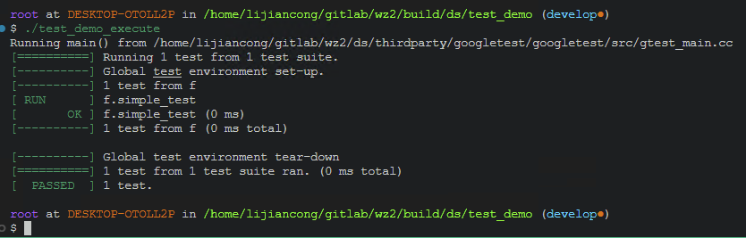

* 改变函数

```c++
int f(int i)
{
    retrun i+1;
}
```

运行结果：

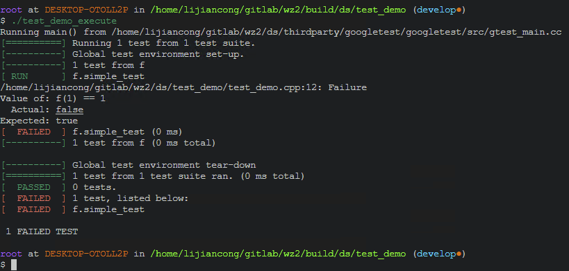

* 类推其他复杂函数

```shell
void f(std::string str, std::string& out)
{
    out = str;
}

TEST(f, simple_test)
{
    std::string in = "Hello world";
    std::string out;

    f(in, out);

    ASSERT_EQ(out, in);
}
```

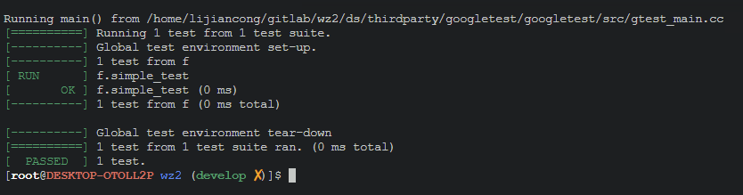

* 为失败添加更多说明

```shell
ASSERT(st.IsSuccess()) << "st is not success!";
ASSERT(st.IsSuccess()) << DBG(st);
```

## ASSERT 宏说明

[GoogleTest ASSERT 官方说明](https://google.github.io/googletest/reference/assertions.html){: .btn .btn--success}

```java
ASSERT_TRUE(condition);     ///< true
ASSERT_FALSE(condition);    ///< false

ASSERT_EQ(val1,val2);       ///< val1 == val2
ASSERT_NE(val1,val2);       ///< val1 != val2

ASSERT_LT(val1,val2);   ///< val1 < val2
ASSERT_LE(val1,val2);   ///< val1 <= val2
ASSERT_GT(val1,val2);   ///< val1 > val2
ASSERT_GE(val1,val2);   ///< val1 >= val2

ASSERT_STRCASEEQ(str1,str2);    ///< str1 == str2(忽略大小写)
ASSERT_FLOAT_EQ(val1,val2);     ///< 浮点数比较,误差小于 4ULP

/// 数值模糊比较，std::abs(val1 - val2) <= abs_error
ASSERT_NEAR(val1,val2,abs_error);

/// 语句 statement 抛出异常，且异常的类型为 exception_type
ASSERT_THROW(statement,exception_type);
/// 语句 statement 抛出异常，但不限定异常类型
ASSERT_ANY_THROW(statement);
/// 语句 statement 不抛出异常
ASSERT_NO_THROW(statement);

/// 验证该语句导致进程以非零退出状态终止，stderr 输出 matcher
ASSERT_DEATH(statement,matcher);
```

## 测试夹具

```java
class class_name : public ::testing::Test
{
public:
    class_name()
    {
        /// 打开数据库链接
        m_pDao = new mysql();
    }

    ~class_name()
    {
        /// 关闭数据库链接
        delete m_pDao;
    }

    CfgDao* m_pDao = nullptr; ///< 数据库实例
};

TEST_F(class_name, description)
{
    ASSERT_TRUE(m_pDao->InsertCallHistory(st));
}
```

## 多线程测试

GoogleTest 没有提供，一个测试用例，在多个线程中同时调用，以证明其线程安全。

但其实现原理可以手动实现，代码如下。

```c++

void GosLog(...)
{
    ...
}

void test_function()
{
    /// 本线程先 sleep 2秒
    std::this_thread::sleep_for(std::chrono::seconds(2));
    /// 调用一万次函数
    for(int i = 0 ; i < 10000; ++i)
    {
        GosLog("Hello world!");
    }
}

TEST(f, simple_test)
{
    std::deque<std::thread> threads;

    for(unsigned i = 0; i < 2; ++i)
    {
        /// 使用 test_function 创建线程
        vec.push_back(std::thread(test_function));
    }

    /// 等待每个线程结束
    for(auto &thread : threads)
    {
        thread.join();
    }
}
```

提取出重复的语句做测试夹具

```c++
#include <thread>
#include <condition_variable>
/**
 * @brief           多线程测试封装
 * @author          lijiancong
 * @date            2023-01-19 17:27:15
 * @note
 */
class mt_unittest : public ::testing::Test
{
protected:
    mt_unittest() {}
    ~mt_unittest() override {}

    // add new work item to the pool
    template <class F, class... Args>
    ::testing::AssertionResult invoke(F&& f, Args&&... args)
    {
        unsigned cpu_thread = std::thread::hardware_concurrency();
        if (cpu_thread <= 2)
        {
            /// 多线程测试要求测试机器， 硬件支持 3 线程以上
            return ::testing::AssertionFailure() << "cpu_thread is less than 2. "
                << std::to_string(cpu_thread);
        }

        auto task = std::bind(std::forward<F>(f), std::forward<Args>(args)...);

        std::vector<std::jthread> vec;
        for (size_t i = 0; i < cpu_thread - 2; ++i)
        {
            vec.push_back(std::jthread(
                [this, task]() mutable
                {
                    std::unique_lock<std::mutex> mutex(mutex_);
                    /// 等待同步开始
                    cv_.wait(mutex, [this] { return ready_; });
                    /// 执行测试函数
                    task();
                }));
        }

        {
            std::lock_guard<std::mutex> guard{mutex_};
            ready_ = true;
        }
        cv_.notify_all();
        return ::testing::AssertionSuccess();
    }

private:
    std::mutex mutex_;
    std::condition_variable cv_;
    bool ready_ = false;
};

TEST_F(mt_unittest, GosLogTest)
{
    ASSERT_TRUE(invoke(
        []()
        {
            for(int i = 0 ; i < 10000; ++i)
            {
                GosLog("Hello world!");
            }
        }));
}
```

## 模板函数测试

```cpp
/**
 * @brief           擦除vector中特定值的元素
 * @param           vec      [out]  要操作的vector
 * @param           value    [in]   要擦除的值
 * @return          size_t  擦除元素的个数
 * @author          lijiancong
 * @note
 */
template <typename Container>
inline size_t erase(Container& vec,
                    const typename Container::value_type& value)
{
    typename Container::iterator it =
        std::remove(vec.begin(), vec.end(), value);
    size_t count = static_cast<size_t>(std::distance(it, vec.end()));
    vec.erase(it, vec.end());
    return count;
}
```

```java
template <typename T>
class gos_erase_test : public testing::Test
{
};

TYPED_TEST_SUITE(gos_erase_test, ::testing::Types<
                                 std::vector<char>,
                                 std::deque<char>,
                                 std::string,
                                 std::vector<int>,
                                 std::deque<int>
                                 >);

TYPED_TEST(gos_erase_test, find_simple_char)
{
    TypeParam n = {'a', 'b', 'b', 'c', 'd'};
    TypeParam cmp{'c', 'd'};
    ASSERT_EQ(1, gos::erase(n, 'a'));
    ASSERT_EQ(2, gos::erase(n, 'b'));
    ASSERT_EQ(cmp, n);
}
```

## Mock 简介

[Mock 入门](https://google.github.io/googletest/gmock_for_dummies.html){: .btn .btn--success}

测试场景

```cpp
class SpeakManager
{
public:
    bool TalkRequest(int number);
};

class GroupCall
{
public:
    bool TalkRequest(int number, SpeakManager& SpeakManager)
    {
        return SpeakManager->TalkRequest(number);
    }
};

TEST(GroupCall, simple_test)
{
    auto p = new SpeakManager;
    ASSERT_TRUE(Groupcall::GI().TalkRequest(4106, p));
}
```

由于 `SpeakManager::TalkRequest()`, 依赖于 SDK 的初始化, 依赖于通话存在，所以为单独测试 `GroupCall::TalkRequest()` 增加了难度。

实现方法:

```java

#include "gtest/gtest.h"
#include "gmock/gmock.h"

/// 接口类
class SpeakManagerBase
{
 public:
    virtual bool TalkRequest(int number) = 0;
};

/// 原业务类
class SpeakManager : public SpeakManagerBase
{
 public:
    /// virtual bool TalkRequest(int number);
    bool TalkRequest(int number) override;
};

/// 模拟类
class SpeakManagerMock : public SpeakManagerBase
{
 public:
    MOCK_METHOD(bool, TalkRequest, (int number), (override));
};

class GroupCall
{
 public:
    static GroupCall& GI()
    {
        static GroupCall instance;
        return instance;
    }

    bool TalkRequest(int number, SpeakManagerBase& SpeakManager)
    {
        return SpeakManager.TalkRequest(number);
    }
};

TEST(GroupCall, simple_test)
{
    using namespace testing;

    SpeakManagerMock SpeakManager;
    /// 规定 TalkRequest 在任意入参时，将会总是返回 true
    EXPECT_CALL(SpeakManager, TalkRequest(_)).WillRepeatedly(Return(true));
    /// 进行测试结果
    ASSERT_TRUE(GroupCall::GI().TalkRequest(4106, SpeakManager));
}

TEST(GroupCall, simple_test_1)
{
    using namespace testing;

    SpeakManagerMock SpeakManager;
    /// 规定 TalkRequest 在入参为 4106 时，将会总是返回 true
    EXPECT_CALL(SpeakManager, TalkRequest(4106))
        .WillRepeatedly(Return(true));
    /// 规定 TalkRequest 在入参在大于 4100 并且不等于 4106 的情况下，总是返回 false
    EXPECT_CALL(SpeakManager, TalkRequest(AllOf(Gt(4100), Ne(4106))))
                                .WillRepeatedly(Return(false));

    /// 进行测试结果
    ASSERT_TRUE(GroupCall::GI().TalkRequest(4106, SpeakManager));

    /// 进行测试结果
    ASSERT_FALSE(GroupCall::GI().TalkRequest(4105, SpeakManager));
}

TEST(GroupCall, simple_test_2)
{
    using namespace testing;

    SpeakManagerMock SpeakManager;
    /// 规定 TalkRequest 在任意入参时，第一次调用返回 true， 第二次返回 false
    EXPECT_CALL(SpeakManager, TalkRequest(_))
        .WillOnce(Return(true))
        .WillOnce(Return(false));

    /// 进行测试结果
    ASSERT_TRUE(GroupCall::GI().TalkRequest(4106, SpeakManager));
    ASSERT_FALSE(GroupCall::GI().TalkRequest(4106, SpeakManager));
}
```

## 自动化测试场景

通常自动化测试的测试用例之间不应存在影响，每个测试用例应拆分为最小可测试单元(函数)，测试用例的顺序应互不影响。

### 工具函数测试

* SQL 语句组装类测试

```java
TEST(sql_utility, simple)
{
    /// insert
    gos::sql sql_string;
    std::string str = sql_string.insert("operation_log")
        .bind("UUID", "555")
        .bind("Time", 666)
        .bind("UserType", "777")
        .bind("UserID", "888")
        .bind("LogInfo", "999")
        .sql();

    ASSERT_EQ(str, "INSERT INTO operation_log(UUID, Time, UserType, UserID, LogInfo) VALUES(\"555\", 666, \"777\", \"888\", \"999\");");

    /// delete
    gos::sql sql;
    std::string strSQL = sql.remove("operation_log")
                            .where("Time < :time")
                            .bind("time", 55).sql();
    ASSERT_EQ(strSQL, "DELETE FROM operation_log WHERE Time < 55;");
}
```

* 时间函数测试

```java
TEST(gos_sleep_1ms, Simple_Test)
{
    gos::tick_count timer;
    /// 开始计时
    timer.start();
    gos_sleep_1ms(1000);
    /// 结束计时
    timer.finish();
    /// 模糊比较，误差不超过 20ms
    ASSERT_TRUE(gos::approx(1000, 20).equal(timer.get_ms()));
}
```

### Json 接口函数测试

在客户端与服务端的通信中，如果使用 `json` 报文来传递事件，那么就存在 结构体序列化成 `json` 与 `json` 反序列化成结构体的过程，现在我们来测试这个过程。

```java
class DC_TO_DIS_LOAD_SDS_HISTORY_C : public gos::json_parser<DC_TO_DIS_LOAD_SDS_HISTORY_C>
{
 public:
    std::string strDCLongNum;  ///< M, 发送者长号码
    UINT32 ulBeginTime;        ///< M, 开始时间, 秒级时间戳
    UINT32 ulEndTime;          ///< M, 结束时间, 秒级时间戳
    UINT32 ulCountLimit;       ///< M, 最多回复记录数

    bool operator==(const DC_TO_DIS_LOAD_SDS_HISTORY_C& stOther) const
    {
        return strDCLongNum == stOther.strDCLongNum &&
               ulBeginTime == stOther.ulBeginTime &&
               ulEndTime == stOther.ulEndTime &&
               ulCountLimit == stOther.ulCountLimit;
    }

    /// 从 json 报文中解析出数值, 并赋予本结构体
    virtual bool StructToJson(std::string& str) const;
    /// 从结构体的数值拼装 json 报文
    virtual bool JsonToStruct(const std::string& str);

    /// 获取一个随机的本结构体
    static DC_TO_DIS_LOAD_SDS_HISTORY_C GetRandomObj();
};

TEST(DC_TO_DIS_LOAD_SDS_HISTORY_C, simple_test)
{
    auto st = DC_TO_DIS_LOAD_SDS_HISTORY_C::GetRandomObj();

    std::string strJson;
    /// 序列化
    ASSERT(st.StructToJson(strJson));

    /// 反序列化
    DC_TO_DIS_LOAD_SDS_HISTORY_C stCmp;
    ASSERT(stCmp.JsonToStruct(strJson));

    /// 判断两个结构体是否相等
    ASSERT_EQ(st, strCmp);
}
```

以上重复的步骤过多，封装后的测试用例较为整洁，如下。

```java
TEST(DC_TO_DIS_LOAD_SDS_HISTORY_C, simple_test)
{
    for(unsigned i = 0; i < 10; ++i)
    {
        auto st = DC_TO_DIS_LOAD_SDS_HISTORY_C::GetRandomObj();

        ASSERT_TRUE(gos::test_json_parser(st));
    }
}
```

### 数据库层自动化测试

数据库函数测试

```java
class CfgDaoTests : public ::testing::Test
{
 protected:
    /// 初始化数据库链接
    CfgDaoTests();

    /// 释放数据库链接
    ~CfgDaoTests() override;

    /**
     * @brief           查询 brd_info 表中是否有记录
     * @param           find    [in]
     * @return          ::testing::AssertionResult
     * @author          lijiancong
     * @date            2022-07-07 16:59:03
     * @note
     */
    ::testing::AssertionResult HaveRowInBrdInfo(const DB_BRD_INFO_C& find)
    {
        /// 查询记录
        std::vector<DB_BRD_INFO_C> vec;

        if (!m_pDao->QueryBrdInfo(vec, 1000))
        {
            return ::testing::AssertionFailure() << "QueryBrdInfo failed!";
        }

        for (const auto& element : vec)
        {
            if (element == find)
            {
                return ::testing::AssertionSuccess();
            }
        }
        return ::testing::AssertionFailure()
                << "can't find struct! " << DBG(find);
    }
};

TEST_F(CfgDaoTests, brd_info_simple_test)
{
    /// 创建随机的结构体
    DB_BRD_INFO_C stDB = DB_BRD_INFO_C::GetRandomObj();

    /// 验证没有该条记录
    ASSERT_FALSE(HaveRowInBrdInfo(stDB));

    /// 插入
    ASSERT_TRUE(m_pDao->InsertBrdInfo(stDB));

    /// 验证有该条记录
    ASSERT_TRUE(HaveRowInBrdInfo(stDB));

    /// 删除该条记录
    ASSERT_TRUE(m_pDao->DeleteBrdInfo(stDB.GetKey()));

    /// 验证没有该条记录
    ASSERT_FALSE(HaveRowInBrdInfo(stDB));
}

TEST_F(CfgDaoTests, call_history_simple_test)
{
    ...
}
```

### 配置文件读取测试

```java
class dc_global_config_manager_test : public ::testing::Test
{
 protected:
    DC_GLOBAL_CONFIG_INFO_C cfg_ = DC_GLOBAL_CONFIG_INFO_C::GetRandomObj();
    std::string m_strFile = "dc_global_config_manager_test.ini";

    dc_global_config_manager_test()
    {
        if (gos_file_exist(m_strFile.c_str()))
        {
            gos_delete_file(m_strFile.c_str());
        }

        /// 生成配置文件
        inifile::IniFile ini_file;

        ini_file.SetBoolValue("DCGlobal", "is_use_link_switch",
                                cfg_.is_use_link_switch_);
        ini_file.SetIntValue("DCGlobal", "ping_interval_time_ms",
                                cfg_.ping_interval_time_ms_);

        /// 保存配置文件
        ini_file.SaveAs(m_strFile);
    }

    ~dc_global_config_manager_test()
    {
        if (gos_file_exist(m_strFile.c_str()))
        {
            gos_delete_file(m_strFile.c_str());
        }
    }
};

TEST_F(dc_global_config_manager_test, DC_GLOBAL_CONFIG_MANAGER)
{
    ASSERT_TRUE(dc_global_config_manager::GI().load(m_strFile));

    auto cfg = dc_global_config_manager::GI().get();

    EXPECT_EQ(cfg_, cfg);
}
```

### 客户端软件集成测试

对于客户端大致有两个调用流程。

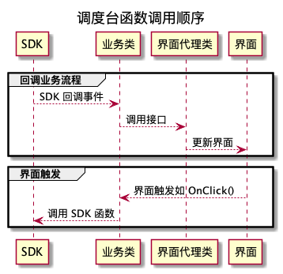

对于回调业务设计:

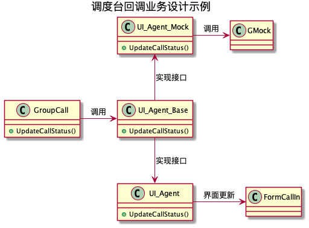

对于以上解决方案，需要客户端把业务类与界面类分开。

界面只根据输入数据进行更新显示。而业务类管理所有业务(管理业务信息)。

### 服务器软件集成测试

同样对于服务端程序，一样可以做代理类而测试业务。

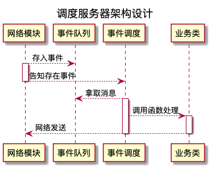

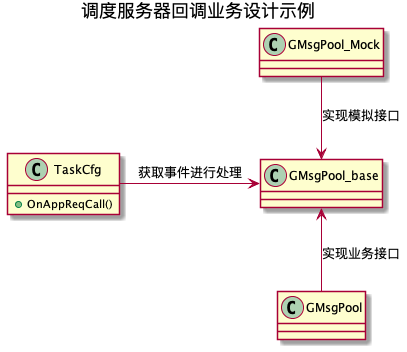

### 服务器业务函数测试

代码举例：

```java
VOID TaskAPP::OnAppRequestCallReq(const std::string &app_id,
                                  const APP_TO_DIS_MSG_INFO_C &stAppMsgInfo)
{
    if (!AppRegisterManager::GI().HandleAppRequestCallReq(app_id,
                                            stAppMsgInfo, this, m_pDao))
    {
        GLOGE("AppRegisterManager HandleAppRequestCallReq failed! %s",
                DBG(stAppMsgInfo));
        return;
    }
}
```

在事件函数中，使用单独的业务函数或业务类，把业务模块(`AppRegisterManager`)与数据库模块(`m_pDao`)还有事件调度模块(`TaskApp`)隔离开后，使用测试普通函数的模式测试该函数。

### 如何组织工程级别单元测试

使用 CMake 来组织工程文件。

#### CMake 简介

CMake是一个跨平台的自动化构建工具，用于管理软件项目的构建过程。它使用一种类似于脚本的语法（CMakeLists.txt文件）来描述项目的构建配置和依赖关系，并生成适合不同构建系统（如Make、Ninja、Visual Studio等）的构建脚本。
{: .notice--info}

* CMake 使用示例：

```shell
cmake .
```

* Windows 下生成的 VS 工程结构

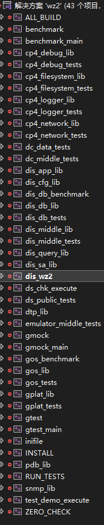

* Linux 下生成的 Makefile:

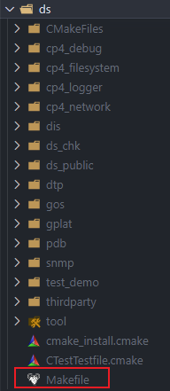

* 编译工程

```shell
# 工程全部编译
cmake --build .
# 工程 clean 后单独编译 Release 下的 dis
cmake --build . --target dis_wz2 --config=Release --clean-first
```

* 使用 CMake 命令自动运行单元测试:

```shell
# CMakeLists.txt 中增加如下语句，注册运行的单元测试
add_test(NAME GosTest COMMAND gos_unittest)

# 命令行运行 Debug 模式下的注册过的所有单元测试
ctest . -C Debug
```

* VS 中可视化界面运行单元测试

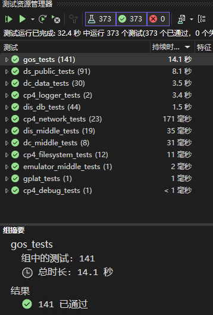

#### 单个文件夹下的文件组织

```bat
.
├── CMakeLists.txt
├── cp4_debug.cpp
├── cp4_debug.hpp
└── cp4_debug_unittest.cpp
```

`CMakeLists.txt`: 工程文件, 其中定义了生成静态库(`libcp4_debug.a`)，生成测试的可执行文件(`cp4_debug_unittest.exe`)。

#### 多个文件夹下的文件组织

```bat
.
├── CMakeLists.txt
├── db
│   ├── CMakeLists.txt
│   ├── CfgDao.cpp
│   └── CfgDao.h
│   └── CfgDao_unittest.cpp
├── middle
│   ├── CMakeLists.txt
│   ├── ATSManager.cpp
│   ├── ATSManager.h
│   ├── ATSManager_unittest.cpp
├── dis_main.cpp
```

服务器中，`app/` 和 `cfg/` 文件夹会分别生成静态库，然后文件 `dis_main.cpp` 、 `libdb.a` 、 `libmiddle.a` 生成 `dis.exe`。

也同时生成对应的测试程序。


#### 如何引用第三方库（如：`GoogleTest`）

```bat
.
├── CMakeLists.txt
├── dis/
│   ├── ...
├── thirdparty/
│   ├── googletest/
│       ├── CMakeLists.txt
|       ├─- ...
```

```shell
# CMakeLists.txt 中增加如下语句，引用第三方库
add_subdirectory(thirdparty/googletest)
```

然后需要使用该第三方库的工程，包含第三方库的头文件，并链接该第三方库的 `libgtest.a` 文件，即可正常使用第三方库。

## 如何确认测试覆盖率

1. g++ 编译选项中添加: `-fprofile-arcs`、 `-ftest-coverage`

```shell
# CMakeLists.txt 中添加
set(CMAKE_C_FLAGS "${CMAKE_C_FLAGS} -Wall -fprofile-arcs -ftest-coverage")
set(CMAKE_CXX_FLAGS "${CMAKE_CXX_FLAGS} -Wall -fprofile-arcs -ftest-coverage")
```

2. 编译并运行单元测试
3. 生成覆盖率信息文件

```shell
gcov <source_file>
```

直接使用 vim 打开该信息文件 `test.c.gcov`

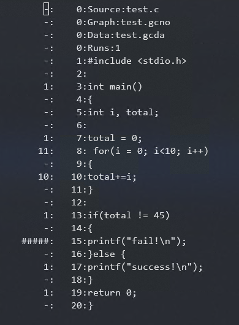

4. 使用`lcov`工具处理`.gcov`文件并生成可读的代码覆盖率报告。使用以下命令：

```shell
lcov -c -d <directory> -o coverage.info
genhtml coverage.info -o coverage_report
```

5. 打开 `coverage_report/index.html` 查看覆盖率报告

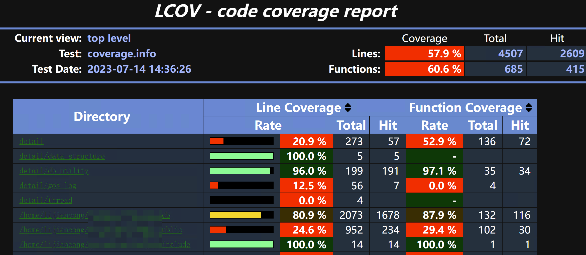

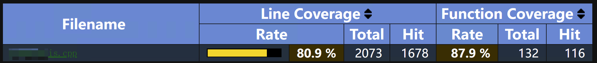

## 提交代码前的自动化测试

在提交 `push` 前，自动生成并运行单元测试， 可以使用 `git` 自带的 `pre-push`.

```bat
.
├── .git
│   ├── branches
│   ├── COMMIT_EDITMSG
│   ├── config
│   ├── description
│   ├── FETCH_HEAD
│   ├── HEAD
│   ├── hooks
│       ├── pre-commit.sample
│       ├── pre-push.sample
```

在 `Linux` 下工程目录下, 找到 `./.git/hooks/pre-push.sample` 文件，复制一份并重命名为 `pre-push`，然后修改 `pre-push` 文件内容为如下：

```sh
 #!/bin/sh
 #
 # An example hook script to verify what is about to be committed.
 # Called by "git push" with no arguments.  The hook should
 # exit with non-zero status after issuing an appropriate message if
 # it wants to stop the push.
 #
 # To enable this hook, rename this file to "pre-push".

 # 自动格式化代码
 python3 ./ClangFormat.py
 # 添加格式化后的代码
 git add .

 # 运行单元测试
 cmake -E chdir "build" cmake .. ; cmake --build ./build/ ; cmake -E chdir "build" ctest .. -C Release

 # If the tests fail, prevent the push
 if [ $? -ne 0 ]; then
     echo "Tests failed. Push aborted."
     exit 1
 fi
```

添加内容后，为该脚本文件增加可执行权限。 `sudo chmod +x pre_push`

如果该脚本运行过程中，异常结束则不会推送代码到远端，并提示错误。