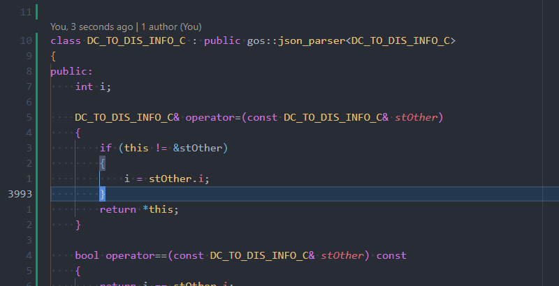
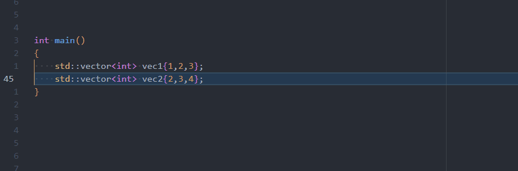
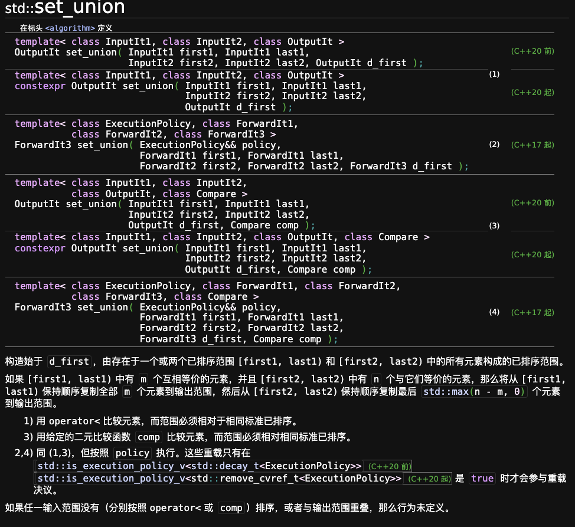
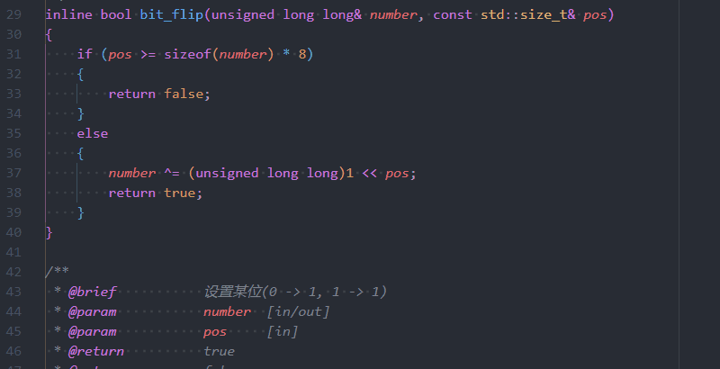
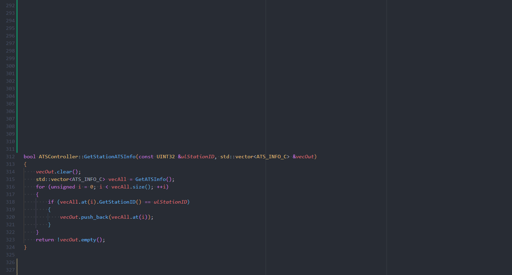
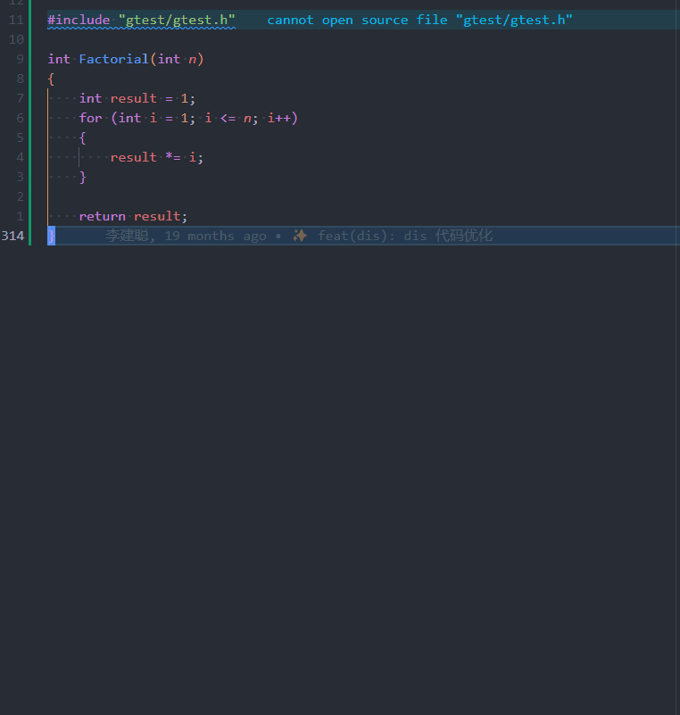
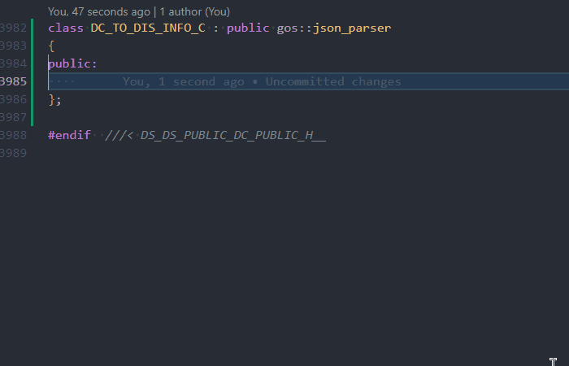
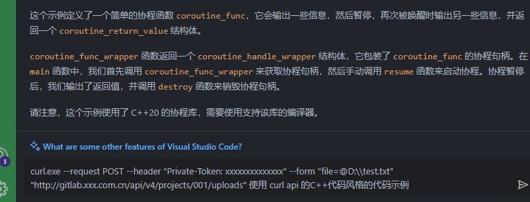
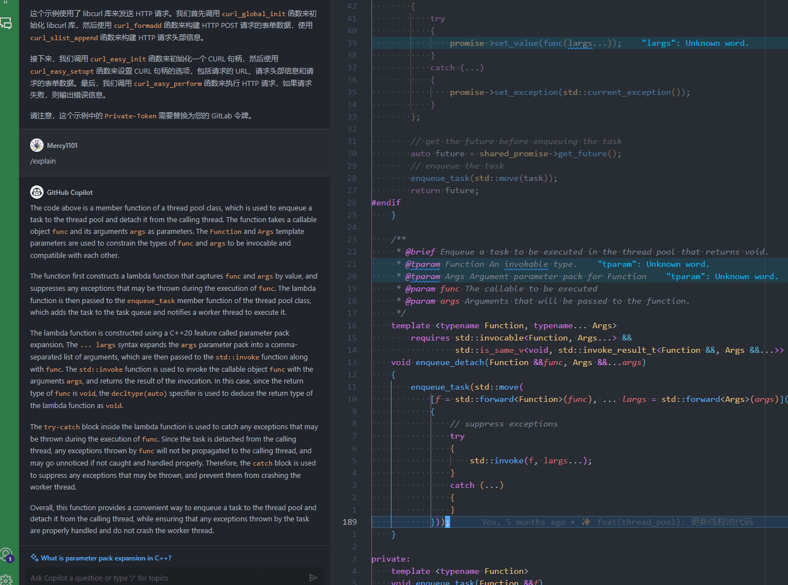

GitHub Copilot是GitHub和OpenAI合作开发的一个人工智能工具，用户在使用Visual Studio Code、Microsoft Visual Studio、Vim、Cursor或JetBrains集成开发环境时可以通过GitHub Copilot自动补全代码。GitHub于2021年6月29日对开公开该软件，GitHub Copilot于技术预览阶段主要面向Python、JavaScript、TypeScript、Ruby和Go等编程语言。

## 提高编码效率

### 按 `Tab` 键自动补全代码

### 结构体添加字段后，类内函数补全

### C++ 标准库补全

* 对比 C++ 标准库手册, 需要阅读繁杂的解释

### 使用注释生成补全代码

* 通用算法

## 为代码生成注释

## 为函数生成测试用例

## 开源库学习

### Asio 网络库代码

文件中包含 `asio.hpp`, 写出类名即可补全对应开源库的示例代码。

### Curl API 代码

使用 `Github Copilot` 的问答功能可以直接询问代码。

## 提高代码阅读效率

* 解释代码

