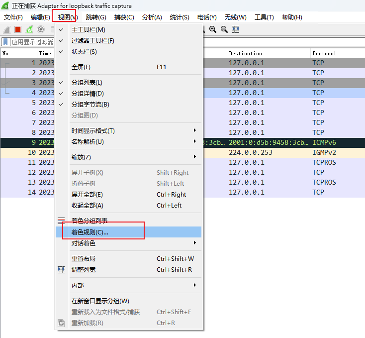
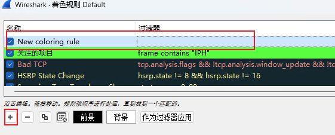
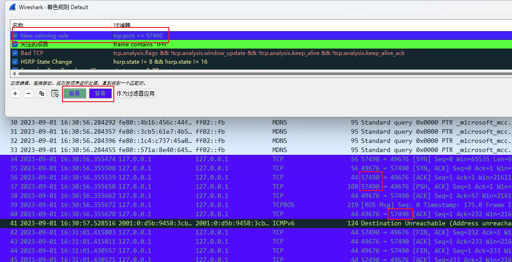
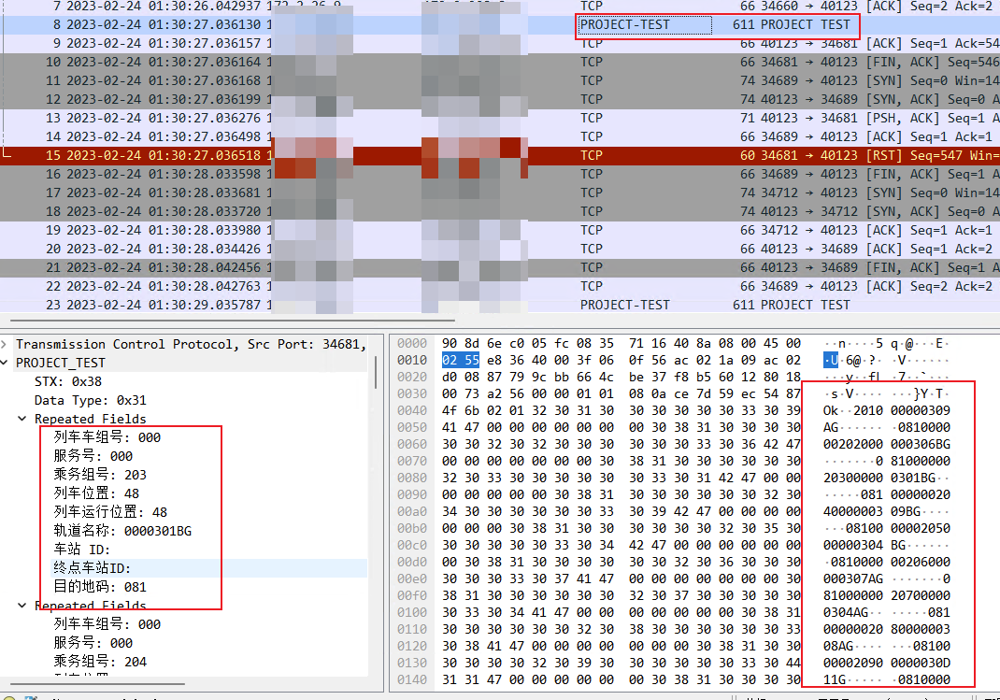

Wireshark 是一款开源的网络协议分析工具，用于捕获和分析网络数据包。它可以在各种操作系统上运行，包括Windows、Mac和Linux。

## 简介

Wireshark 的主要功能包括：

1. 数据包捕获：Wireshark 可以捕获计算机网络上的数据包，包括传输层和网络层的数据。它可以监听网络接口，捕获经过该接口的数据包，并显示它们的详细信息。

2. 数据包分析：Wireshark 可以解析捕获的数据包，并以易于理解的方式显示各个协议层的字段和值。它支持多种协议，包括以太网、IP、TCP、UDP、HTTP、DNS等。通过分析数据包，可以检查网络通信中的问题、识别潜在的安全漏洞，并进行性能优化。

3. 过滤和搜索：Wireshark 提供了强大的过滤和搜索功能，以帮助用户快速定位感兴趣的数据包。用户可以使用过滤器来过滤特定协议、源/目标IP地址、端口号等。此外，Wireshark 还提供了高级搜索功能，可以根据特定的字段值或表达式搜索数据包。

4. 统计和报告：Wireshark 可以生成各种统计信息和报告，以帮助用户分析网络流量和性能。它可以提供关于数据包数量、协议分布、流量图表、响应时间等方面的统计数据，并支持导出报告到不同的格式。

## 使用技巧

### 报文着色

我们可以自定义报文的颜色高亮，操作如下：

点击 `视图` -> `着色规则`

见到如下界面, 点击新建着色规则

输入对应的过滤规则，则可以看到对应的报文着色

过滤规则与过滤报文规则相同，例如：

1. `tcp.port == 62001`, 查看使用 `62001` 端口的 `tcp` 协议的报文
2. `frame contain "MsgID: 112"`: 查看包含字符串 `MsgID: 112` 的报文

### 自定义协议

我们可以使用 `lua` 插件来实现 `wireshark` 自动解析二进制报文的功能，见如下操作：

其中需要编写 [`PROJECT_TEST.lua`](../resource/2023-09-01-wireshark-skills/PROJECT_TEST.lua) 文件放置到`wireshark`的 `plugin` 目录下(例如: `C:\Program Files\Wireshark\plugins`)

可以对照文件修改对应的私有协议，方便现场抓包分析

