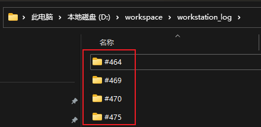
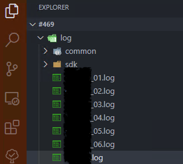
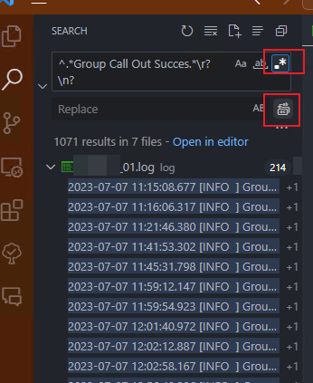
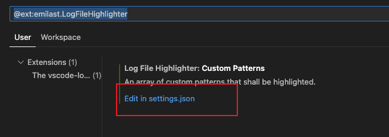
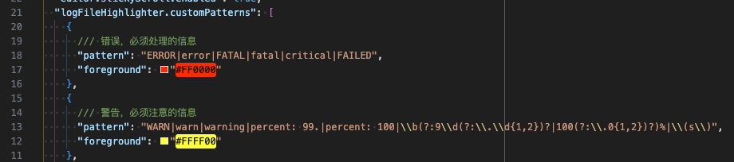
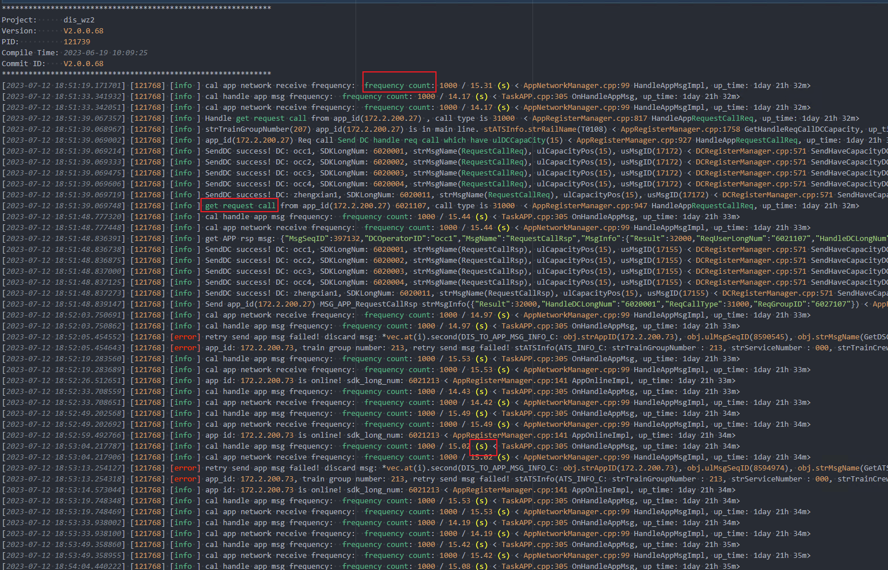

---
title: "日志文件查看技巧"
toc: true
show_date: true
toc_sticky: true
author_profile: true
---

日志文件通常包含大量打印，如何快速定位问题，是每个程序员所需要掌握的技能。

本篇文章教你使用 VSCode 及其插件来查看日志。

## 日志文件查看

### 多日志文件查看

通常一个问题包含多个文件，所以多文件搜索变得很重要。

我通常会使用 issue 号的名称来创建专门的日志文件夹，如下图：



在文件夹内使用 VSCode 打开即可在文件夹内查看日志, 搜索也是可以默认搜索文件夹内所有文件



### 错误日志太多, 难以搜索真正错误

我们经常遇到一个 error 日志打印出来其实并不意味着错误(首先我们应该先把错误日志改为警告等级，或者直接删除该条打印)，但该条日志疯狂打印，导致掩盖了原有的信息。

如果我们把刷屏的日志删除掉就可以直接搜索 error，来查看真正的错误信息了。

那我们有办法删除它么？当然有，使用正则表达式来选中这些日志

正则表达式
```sh
^.*你想要匹配的字符串.*\r?\n?

例:
^.*retry send app msg failed.*\r?\n?
^.*Find no position.*\r?\n?
^.*SetRegisterStatus: strLongNum.*\r?\n?
```

在 VsCode 中勾选**正则表达式查找**，**替换所有**找到的日志为空字符串，即可达到删除重复日志的目的。



### 想要突出显示特定的日志

可以使用日志高亮插件 "Log File Highlighter", 在 VSCode 插件商店搜索安装即可。

该插件可以使用配置来制定高亮的日志：





使用如下配置：

可以让 ERROR， error 等文本，在日志文件中被显示为红色

```json
  "logFileHighlighter.customPatterns": [
    {
      /// 错误，必须处理的信息
      "pattern": "ERROR|error|FATAL|fatal|critical|FAILED",
      "foreground": "#FF0000"
    },
  ],
```

使用效果：




根据我自己的使用习惯，我把日志的高亮进行分类：

1. 错误，必须处理的信息
2. 警告，必须注意的信息
3. 信息，值得注意的问题
4. 调试，用于调试程序的信息
5. 详细信息，可以忽略的信息
6. 当前关注的信息（需要每次更新）

以下是我的配置：

```json
  "logFileHighlighter.customPatterns": [
    {
      /// 错误，必须处理的问题
      "pattern": "ERROR|error|FATAL|fatal|critical|FAILED",
      "foreground": "#FF0000"
    },
    {
      /// 警告，必须注意的信息
      "pattern": "WARN|warn|warning|percent: 99.|percent: 100|\\b(?:9\\d(?:\\.\\d{1,2})?|100(?:\\.0{1,2})?)%|\\(s\\)",
      "foreground": "#FFFF00"
    },
    {
      /// 信息，值得注意的信息
      "pattern": "(\"DCCapacityPos\":｜get APP request call|INFO  |info |RUN|OK|PASSED|Send DC handle req call which have ulDCCapaCity|spPID->usInstID|spPID->usTaskID|link auth successful, client|RequestCallReq|Dialling is handle as link call.|Function Avg Time:|frequency count|get SA msg:|server_close_connect|OnServerDisconnectClient usClientID|tcp_send: send failed, Socket|SetButtonStatus|get request call|is not need save link group call|handle auto pick up group|Dialling is handle as group call.|eSDK_SendSMS|Skip not auto pick up group|is not auto pick up!|get app request call|Group Call Speaker Change:|OnRequestCallReq|\\(31\\)|\\(34\\)|\\(36\\))",
      "foreground": "#42B883"
    },
    {
      /// 调试，用于调试程序的信息
      "pattern": "debug|Debug|DEBUG|Spend Time|Memory Change|Total Time|interval_time_factory",
      "foreground": "#007FFF"
    },
    {
      /// 详细信息，可以忽略的信息
      "pattern": "DETAIL|detail",
      "foreground": "#2F90B9"
    },
    {
      /// 当前关注的信息（需要每次更新）
      "pattern": "172.2.200.29|172.2.200.69",
      "foreground": "#000000",
      "background": "#19F334"
    }
  ],
```


