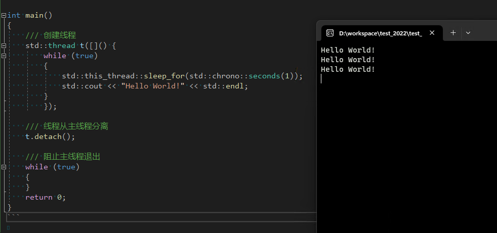
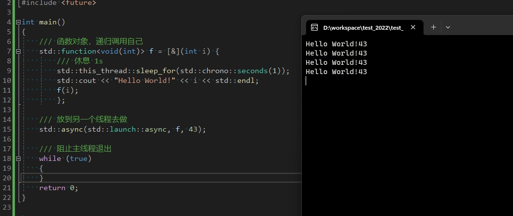

---
title: "C++简单定时器事件实现"
toc: true
show_date: true
toc_sticky: true
author_profile: true
---

使用 C++ 来实现定时器事件，可以使用 `std::thread` 来实现，也可以使用 `std::async` 来实现。

## std::thread

```cpp
#include <iostream>
#include <thread>

int main()
{
    /// 创建线程
    std::thread t([]() {
        while (true)
        {
            std::this_thread::sleep_for(std::chrono::seconds(1));
            std::cout << "Hello World!" << std::endl;
        }
        });

    /// 线程从主线程分离
    t.detach();

    /// 阻止主线程退出
    while (true)
    {
    }
    return 0;
}
```

运行结果：



## std::async

```cpp
#include <iostream>
#include <future>
#include <thread>

int main()
{
    /// 函数对象递归调用自己
    std::function<void(int)> f = [&](int i) {
            /// 休息1秒
            std::this_thread::sleep_for(std::chrono::seconds(1));
            std::cout << "Hello World!" << i << std::endl;
            f(i);
        };

    std::async(std::launch::async, f, 43);

    /// 阻止主线程退出
    while (true)
    {
    }
    return 0;
}
```

运行结果：

